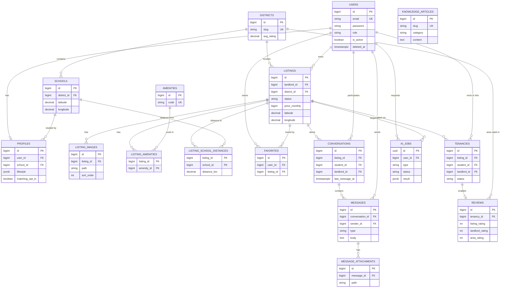
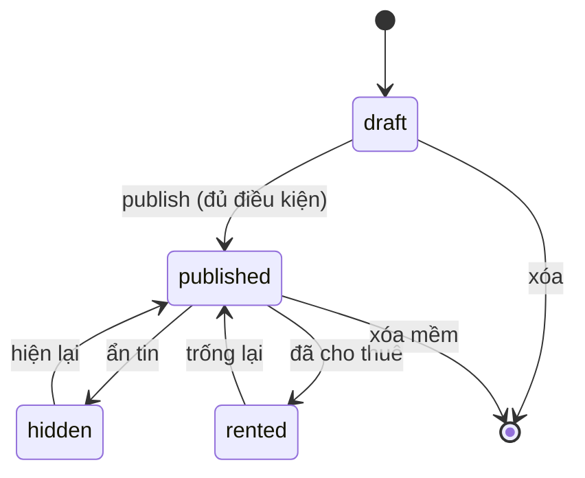
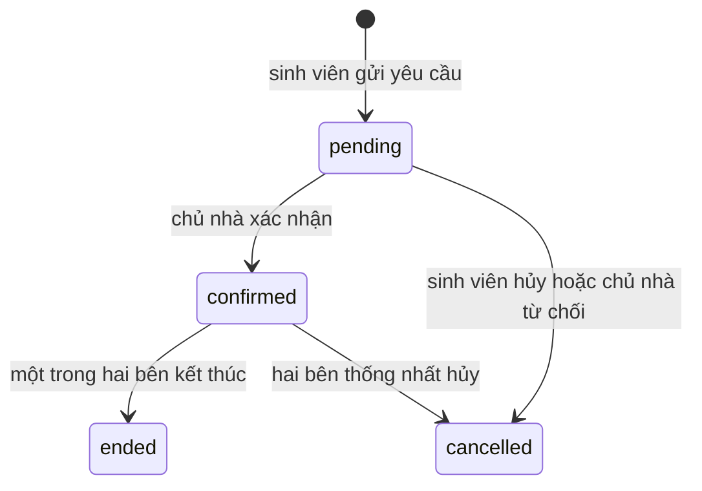

# ERD & THIẾT KẾ DATABASE

Tài liệu đặc tả database PostgreSQL cho **Rental House Platform**. Đây là nguồn sự thật cho toàn bộ migration, model, factory và seeder của Backend (Laravel 11). Đọc cùng `API_CONTRACT.md`.

| Mục | Giá trị |
|---|---|
| Phiên bản | 1.0.0 (Draft) |
| DBMS | PostgreSQL 15+ |
| Extension bắt buộc | `pg_trgm` (tìm kiếm văn bản) |
| Extension không dùng | PostGIS (dùng lat/lng + Haversine, xem mục 4.3) |
| Chủ sở hữu | Backend (duy nhất được truy cập DB, AI Service không truy cập) |

---

## MỤC LỤC

1. Quy ước chung
2. Sơ đồ ERD
3. Đặc tả từng bảng
4. Quy tắc nghiệp vụ gắn với dữ liệu
5. Redis: danh mục key
6. Thứ tự migration
7. Seeder & Factory
8. Model & quan hệ Eloquent

---

## 1. Quy ước chung

1. **Khóa chính**: `bigint` tự tăng (`$table->id()`), riêng `ai_jobs` dùng `uuid`.
2. **Thời gian**: `timestampTz` (`$table->timestampsTz()`), lưu UTC. Cột `deleted_at` (soft delete) chỉ có ở `users`, `listings`.
3. **Tiền**: số nguyên VND (`unsignedBigInteger`), không dùng số thực. Ví dụ 3.500.000 đồng lưu `3500000`.
4. **Tọa độ**: `decimal(10,7)` cho `latitude`, `longitude`.
5. **Enum**: lưu `string(30)` kèm **PHP Backed Enum** ở tầng ứng dụng, **không** dùng kiểu `ENUM` của PostgreSQL (khó migrate). Thêm `CHECK` constraint khi cần chặn dữ liệu sai ở mức DB.
6. **JSON**: dùng `jsonb`. Cấu trúc bên trong được mô tả ở mục 3 và validate bằng FormRequest.
7. **Tên bảng**: số nhiều, snake_case. **Tên cột**: snake_case. Khóa ngoại: `{bảng_số_ít}_id`.
8. **Khóa ngoại**: luôn khai báo `foreignId()->constrained()` kèm hành vi xóa được nêu ở từng bảng. Mọi cột FK đều có index.
9. **Chuỗi tiếng Việt**: cột chuỗi dùng collation mặc định UTF-8. Tìm kiếm không phân biệt hoa thường dùng `ILIKE` + index `pg_trgm`.

---

## 2. Sơ đồ ERD



`KNOWLEDGE_ARTICLES` là bảng độc lập, làm nguồn tri thức (mẫu hợp đồng, FAQ, cẩm nang khu vực) mà Backend chọn lọc rồi gửi kèm cho chatbot.

---

## 3. Đặc tả từng bảng

Ký hiệu: **NN** = NOT NULL, **UQ** = unique, **IDX** = có index.

### 3.1 `users`

| Cột | Kiểu | Ràng buộc | Ghi chú |
|---|---|---|---|
| id | bigint | PK | |
| name | string(100) | NN | |
| email | string(255) | NN, UQ | Lưu chữ thường |
| email_verified_at | timestampTz | null | |
| password | string(255) | NN | Hash mặc định của Laravel |
| role | string(20) | NN, IDX | `student`, `landlord`, `admin`. CHECK trong danh sách |
| phone | string(20) | null | Chỉ hiển thị cho người dùng đã đăng nhập |
| avatar_path | string(500) | null | Đường dẫn trên disk `public` |
| is_active | boolean | NN, default true | false = bị khóa, không đăng nhập được |
| remember_token | string(100) | null | |
| created_at, updated_at | timestampTz | | |
| deleted_at | timestampTz | null | Soft delete |

### 3.2 `profiles`

Quan hệ 1-1 với `users`, tạo tự động khi đăng ký (rỗng). Cột dành riêng cho sinh viên sẽ null với chủ nhà và ngược lại.

| Cột | Kiểu | Ràng buộc | Ghi chú |
|---|---|---|---|
| id | bigint | PK | |
| user_id | bigint | FK users, UQ, NN | ON DELETE CASCADE |
| bio | text | null | Tối đa 1000 ký tự |
| gender | string(20) | null | `male`, `female`, `other` |
| date_of_birth | date | null | |
| **— Sinh viên —** | | | |
| school_id | bigint | FK schools, null, IDX | ON DELETE SET NULL |
| year_of_study | smallint | null | 1 đến 8 |
| budget_min | unsignedBigInteger | null | VND/tháng |
| budget_max | unsignedBigInteger | null | Phải lớn hơn hoặc bằng budget_min |
| preferred_district_ids | jsonb | NN, default `[]` | Mảng id khu vực |
| lifestyle | jsonb | NN, default `{}` | Schema bên dưới |
| interests | jsonb | NN, default `[]` | Mảng chuỗi, tối đa 10 phần tử, mỗi phần tử tối đa 30 ký tự |
| matching_opt_in | boolean | NN, default false | true = cho phép xuất hiện trong gợi ý bạn cùng phòng |
| roommate_gender_preference | string(20) | NN, default `any` | `any` hoặc `same_gender` |
| **— Chủ nhà —** | | | |
| contact_note | string(500) | null | Ví dụ khung giờ liên hệ |
| avg_rating | decimal(3,2) | NN, default 0 | Tổng hợp từ `reviews.landlord_rating` |
| reviews_count | unsignedInteger | NN, default 0 | |
| **— Chung —** | | | |
| onboarding_completed_at | timestampTz | null | |
| created_at, updated_at | timestampTz | | |

**Schema `lifestyle` (jsonb).** Các khóa nằm trong danh sách dưới đây, khóa lạ bị từ chối khi validate:

```json
{
  "sleep_schedule": "early_bird | normal | night_owl",
  "cleanliness": 1,
  "noise_tolerance": 1,
  "smoking": "never | outside_only | yes",
  "guests_frequency": "never | sometimes | often",
  "cooking": "never | sometimes | often",
  "pets": false,
  "personality": "introvert | ambivert | extrovert",
  "study_place": "home | library | mixed"
}
```

`cleanliness` và `noise_tolerance` là số nguyên 1 đến 5. Hồ sơ sinh viên được coi là **đủ điều kiện dùng AI matching** khi có `school_id`, `budget_min`, `budget_max` và tối thiểu các khóa `sleep_schedule`, `cleanliness`, `noise_tolerance`, `smoking`, `personality` trong `lifestyle`.

### 3.3 `districts`

Dùng làm "khu vực" trong bộ lọc, gợi ý AI và đánh giá khu vực.

| Cột | Kiểu | Ràng buộc | Ghi chú |
|---|---|---|---|
| id | bigint | PK | |
| city | string(100) | NN | |
| name | string(100) | NN | |
| slug | string(150) | NN, UQ | |
| latitude, longitude | decimal(10,7) | NN | Tâm khu vực |
| avg_rating | decimal(3,2) | NN, default 0 | Tổng hợp từ `reviews.area_rating` |
| reviews_count | unsignedInteger | NN, default 0 | |
| created_at, updated_at | timestampTz | | |

Unique `(city, name)`.

### 3.4 `schools`

| Cột | Kiểu | Ràng buộc | Ghi chú |
|---|---|---|---|
| id | bigint | PK | |
| name | string(200) | NN | |
| short_name | string(50) | null | |
| address | string(300) | null | |
| district_id | bigint | FK districts, NN, IDX | ON DELETE RESTRICT |
| latitude, longitude | decimal(10,7) | NN | |
| created_at, updated_at | timestampTz | | |

### 3.5 `listings`

| Cột | Kiểu | Ràng buộc | Ghi chú |
|---|---|---|---|
| id | bigint | PK | |
| landlord_id | bigint | FK users, NN, IDX | ON DELETE RESTRICT (chủ nhà bị xóa mềm thì tin ẩn theo) |
| title | string(200) | NN | |
| description | text | null | |
| description_source | string(20) | NN, default `manual` | `manual` hoặc `ai_draft` |
| property_type | string(30) | NN, IDX | `room`, `apartment`, `house`, `shared_room` |
| status | string(20) | NN, default `draft`, IDX | `draft`, `published`, `rented`, `hidden` |
| price_monthly | unsignedBigInteger | NN | VND. CHECK từ 100.000 đến 100.000.000 |
| deposit_amount | unsignedBigInteger | null | Tiền cọc |
| electricity_price | unsignedInteger | null | VND/kWh |
| water_price | unsignedInteger | null | VND/m3 hoặc VND/người, ghi rõ trong mô tả |
| area_m2 | decimal(6,1) | NN | Từ 5 đến 1000 |
| max_occupants | smallint | NN, default 1 | Từ 1 đến 20 |
| available_from | date | null | |
| address_line | string(300) | NN | Số nhà, đường, phường |
| district_id | bigint | FK districts, NN, IDX | ON DELETE RESTRICT |
| latitude, longitude | decimal(10,7) | NN | Do chủ nhà ghim trên bản đồ, Backend không geocode |
| avg_rating | decimal(3,2) | NN, default 0 | Tổng hợp từ `reviews.listing_rating` |
| reviews_count | unsignedInteger | NN, default 0 | |
| favorites_count | unsignedInteger | NN, default 0 | |
| views_count | unsignedInteger | NN, default 0 | |
| published_at | timestampTz | null | Lần đầu chuyển sang `published` |
| created_at, updated_at | timestampTz | | |
| deleted_at | timestampTz | null | Soft delete |

**Index:**

1. `(status, price_monthly)` cho lọc giá của tin công khai.
2. `(status, district_id)`.
3. `(latitude, longitude)` cho truy vấn bounding box của bản đồ.
4. `(landlord_id, status)`.
5. GIN `pg_trgm` trên `title` và `address_line` phục vụ tham số `q`:
   `CREATE INDEX listings_title_trgm ON listings USING gin (title gin_trgm_ops);`

### 3.5.1 `listing_images`

| Cột | Kiểu | Ràng buộc | Ghi chú |
|---|---|---|---|
| id | bigint | PK | |
| listing_id | bigint | FK listings, NN, IDX | ON DELETE CASCADE |
| path | string(500) | NN | Ảnh gốc đã nén, cạnh dài tối đa 1920px |
| thumbnail_path | string(500) | null | Cạnh dài 480px, tạo bằng job |
| sort_order | smallint | NN, default 0 | |
| is_cover | boolean | NN, default false | Mỗi tin tối đa 1 ảnh bìa |
| created_at, updated_at | timestampTz | | |

Tối đa 10 ảnh mỗi tin.

### 3.6 `amenities`

| Cột | Kiểu | Ràng buộc | Ghi chú |
|---|---|---|---|
| id | bigint | PK | |
| code | string(50) | NN, UQ | Ví dụ `wifi`. Đây là giá trị FE/AI dùng |
| name | string(100) | NN | Tên hiển thị tiếng Việt |
| icon | string(50) | null | Tên icon phía FE |

### 3.6.1 `listing_amenities` (bảng nối)

`listing_id` (FK, ON DELETE CASCADE) + `amenity_id` (FK, ON DELETE CASCADE), khóa chính kép `(listing_id, amenity_id)`, thêm index ngược `(amenity_id, listing_id)`.

### 3.7 `listing_school_distances`

Khoảng cách đường chim bay **đã tính sẵn** từ tin đến các trường trong bán kính 15 km.

| Cột | Kiểu | Ràng buộc | Ghi chú |
|---|---|---|---|
| listing_id | bigint | FK listings, ON DELETE CASCADE | PK kép |
| school_id | bigint | FK schools, ON DELETE CASCADE | PK kép |
| distance_km | decimal(6,2) | NN | |

Index `(school_id, distance_km)` cho lọc `max_distance_km` và sắp xếp theo khoảng cách.

### 3.8 `favorites`

| Cột | Kiểu | Ràng buộc |
|---|---|---|
| id | bigint | PK |
| user_id | bigint | FK users, NN, ON DELETE CASCADE |
| listing_id | bigint | FK listings, NN, ON DELETE CASCADE |
| created_at | timestampTz | NN |

Unique `(user_id, listing_id)`. Index `(user_id, created_at DESC)`.

### 3.9 `conversations`

| Cột | Kiểu | Ràng buộc | Ghi chú |
|---|---|---|---|
| id | bigint | PK | |
| listing_id | bigint | FK listings, NN, IDX | ON DELETE CASCADE |
| student_id | bigint | FK users, NN, IDX | ON DELETE CASCADE |
| landlord_id | bigint | FK users, NN, IDX | Sao chép từ `listings.landlord_id` lúc tạo |
| last_message_at | timestampTz | null, IDX | |
| student_last_read_at | timestampTz | null | Dùng tính số tin chưa đọc |
| landlord_last_read_at | timestampTz | null | |
| created_at, updated_at | timestampTz | | |

Unique `(listing_id, student_id)`. Hội thoại chỉ do sinh viên khởi tạo.

### 3.10 `messages`

| Cột | Kiểu | Ràng buộc | Ghi chú |
|---|---|---|---|
| id | bigint | PK | Tăng đơn điệu, dùng làm con trỏ polling |
| conversation_id | bigint | FK conversations, NN | ON DELETE CASCADE |
| sender_id | bigint | FK users, NN | ON DELETE CASCADE |
| type | string(20) | NN, default `text` | `text`, `attachment`, `system` |
| body | text | null | Tối đa 2000 ký tự. Được null khi chỉ gửi tệp |
| created_at, updated_at | timestampTz | | |

Index `(conversation_id, id)`.

### 3.10.1 `message_attachments`

| Cột | Kiểu | Ghi chú |
|---|---|---|
| id | bigint PK | |
| message_id | bigint FK, NN, IDX | ON DELETE CASCADE |
| disk | string(30) NN | Mặc định `private` |
| path | string(500) NN | |
| original_name | string(255) NN | |
| mime_type | string(100) NN | MIME thực, kiểm tra từ nội dung tệp |
| size_bytes | unsignedBigInteger NN | |
| created_at | timestampTz | |

### 3.11 `tenancies`

Ghi nhận việc thuê, là **điều kiện cần** để được đánh giá.

| Cột | Kiểu | Ràng buộc | Ghi chú |
|---|---|---|---|
| id | bigint | PK | |
| listing_id | bigint | FK listings, NN, IDX | ON DELETE RESTRICT |
| student_id | bigint | FK users, NN, IDX | ON DELETE RESTRICT |
| landlord_id | bigint | FK users, NN, IDX | Sao chép từ tin |
| status | string(20) | NN, default `pending`, IDX | `pending`, `confirmed`, `ended`, `cancelled` |
| start_date | date | NN | |
| end_date | date | null | |
| confirmed_at | timestampTz | null | |
| created_at, updated_at | timestampTz | | |

Unique một phần: mỗi cặp `(listing_id, student_id)` chỉ có tối đa một bản ghi ở trạng thái `pending` hoặc `confirmed`:
`CREATE UNIQUE INDEX tenancies_active_unique ON tenancies (listing_id, student_id) WHERE status IN ('pending','confirmed');`

### 3.12 `reviews`

Một bản ghi chứa **ba đánh giá** (nhà, chủ nhà, khu vực) cho một lần thuê.

| Cột | Kiểu | Ràng buộc | Ghi chú |
|---|---|---|---|
| id | bigint | PK | |
| tenancy_id | bigint | FK tenancies, NN, **UQ** | Mỗi lần thuê một đánh giá |
| reviewer_id | bigint | FK users, NN, IDX | Sinh viên |
| listing_id | bigint | FK listings, NN, IDX | Sao chép để truy vấn nhanh |
| landlord_id | bigint | FK users, NN, IDX | |
| district_id | bigint | FK districts, NN, IDX | Lấy từ tin |
| listing_rating | smallint | NN | CHECK 1 đến 5 |
| listing_comment | text | null | Tối đa 1000 ký tự |
| landlord_rating | smallint | NN | CHECK 1 đến 5 |
| landlord_comment | text | null | |
| area_rating | smallint | NN | CHECK 1 đến 5 |
| area_comment | text | null | |
| landlord_reply | text | null | Chủ nhà phản hồi, tối đa 1000 ký tự |
| landlord_replied_at | timestampTz | null | |
| is_hidden | boolean | NN, default false | Admin ẩn nội dung vi phạm |
| created_at, updated_at | timestampTz | | |

### 3.13 `ai_jobs`

| Cột | Kiểu | Ràng buộc | Ghi chú |
|---|---|---|---|
| id | uuid | PK | |
| user_id | bigint | FK users, NN, IDX | ON DELETE CASCADE |
| listing_id | bigint | FK listings, null | ON DELETE CASCADE |
| type | string(40) | NN | Hiện tại chỉ `listing_description` |
| status | string(20) | NN, default `pending`, IDX | `pending`, `processing`, `done`, `failed` |
| input | jsonb | NN, default `{}` | Tham số yêu cầu (không chứa ảnh nhị phân) |
| result | jsonb | null | Kết quả khi `done` |
| error_code | string(50) | null | Khi `failed` |
| error_message | string(500) | null | |
| attempts | smallint | NN, default 0 | |
| started_at, finished_at | timestampTz | null | |
| created_at, updated_at | timestampTz | | |

### 3.14 `knowledge_articles`

| Cột | Kiểu | Ràng buộc | Ghi chú |
|---|---|---|---|
| id | bigint | PK | |
| category | string(30) | NN, IDX | `contract`, `faq`, `area_guide` |
| title | string(200) | NN | |
| slug | string(200) | NN, UQ | |
| content | text | NN | |
| district_id | bigint | FK districts, null | Dùng cho `area_guide` |
| is_published | boolean | NN, default true | |
| created_at, updated_at | timestampTz | | |

Chỉ mục GIN `to_tsvector('simple', title || ' ' || content)` để chọn bài liên quan cho chatbot, hoặc dùng `ILIKE` + `pg_trgm` cho bản đầu.

### 3.15 Bảng mặc định của Laravel

Giữ lại: `password_reset_tokens`, `failed_jobs`, `migrations`. Session, cache, queue dùng driver **Redis** nên không cần bảng `sessions`, `cache`, `jobs`.

---

## 4. Quy tắc nghiệp vụ gắn với dữ liệu

### 4.1 Chuyển trạng thái tin đăng (`listings.status`)



**Điều kiện `draft → published`:** có ít nhất 1 ảnh, `description` tối thiểu 30 ký tự, đủ các cột NN, chủ nhà đã xác thực email (nếu bật cờ `REQUIRE_EMAIL_VERIFICATION`). Lần đầu chuyển sang `published` thì gán `published_at`. Chỉ tin `published` mới xuất hiện trong danh sách công khai và bản đồ.

### 4.2 Chuyển trạng thái thuê (`tenancies.status`)



Điều kiện tạo `pending`: giữa sinh viên và chủ nhà **đã có hội thoại** về tin đó. Đánh giá chỉ được tạo khi `status IN ('confirmed','ended')`.

### 4.3 Khoảng cách tới trường

1. Dùng công thức Haversine với bán kính Trái Đất 6371 km, làm tròn 2 chữ số thập phân. Đây là khoảng cách **đường chim bay**, không phải quãng đường đi thực tế.
2. Job `RecalculateListingDistances(listing_id)` chạy khi: tin được tạo, `latitude`/`longitude` thay đổi. Job xóa các dòng cũ của tin và ghi lại các trường trong bán kính 15 km.
3. Khi thêm trường mới (`schools`), chạy lệnh Artisan `distances:rebuild` để tính lại cho mọi tin `published`.
4. Bán kính 15 km: lọc theo `max_distance_km` lớn hơn 15 sẽ bị chặn ở validation (tối đa 15).

### 4.4 Duy trì các cột tổng hợp

| Cột tổng hợp | Nguồn | Khi nào cập nhật |
|---|---|---|
| `listings.avg_rating`, `reviews_count` | `AVG(reviews.listing_rating)` với `is_hidden = false` | Job `UpdateRatingAggregates(review_id)` sau khi tạo review hoặc admin ẩn/hiện review |
| `profiles.avg_rating`, `reviews_count` (chủ nhà) | `AVG(reviews.landlord_rating)` theo `landlord_id` | Như trên |
| `districts.avg_rating`, `reviews_count` | `AVG(reviews.area_rating)` theo `district_id` | Như trên |
| `listings.favorites_count` | Số dòng `favorites` | Tăng/giảm trong cùng transaction khi thêm/bỏ yêu thích |
| `listings.views_count` | Bộ đếm Redis | Job chạy mỗi phút cộng dồn từ Redis vào DB |

Điểm trung bình làm tròn 2 chữ số. Khi không còn review nào thì đặt về 0.

### 4.5 Xóa dữ liệu

1. Người dùng bị xóa: soft delete. Tin đăng của chủ nhà chuyển `hidden`, hội thoại và đánh giá được giữ nguyên.
2. Khi xóa tin (soft delete): giữ `conversations`, `tenancies`, `reviews` để bảo toàn lịch sử.
3. Xóa ảnh khỏi disk khi bản ghi `listing_images` bị xóa (observer hoặc job).

---

## 5. Redis: danh mục key

| Key | Kiểu | TTL | Nội dung / Xóa khi |
|---|---|---|---|
| `listings:list:{sha1(query)}` | string (JSON) | 120 giây | Kết quả danh sách. Dùng cache tag `listings`, flush tag khi tin thay đổi |
| `listings:map:{sha1(query)}` | string (JSON) | 60 giây | Kết quả bản đồ, cùng tag `listings` |
| `meta:districts`, `meta:schools`, `meta:amenities` | string (JSON) | 1 giờ | Dữ liệu tham chiếu. Xóa khi seed lại |
| `listing:views:{listing_id}` | counter | không hết hạn | Cộng dồn lượt xem, job flush về DB |
| `ai:roommates:{user_id}` | string (JSON) | 1 giờ | Xóa khi hồ sơ người dùng đổi |
| `ai:price:{listing_id}:{sha1(input)}` | string (JSON) | 24 giờ | |
| `ai:areas:{sha1(input)}` | string (JSON) | 6 giờ | |
| `ai:chat:{session_id}` | list | 2 giờ (làm mới khi có tin) | Tối đa 20 lượt gần nhất |
| `throttle:*` | Laravel rate limiter | theo cửa sổ | |
| Session và queue | Laravel mặc định | | |

---

## 6. Thứ tự migration

Đặt tên file theo dạng `YYYY_MM_DD_HHMMSS_create_{bảng}_table.php`. Thứ tự (bảng phụ thuộc phải sau bảng mà nó tham chiếu):

1. Bật extension: `CREATE EXTENSION IF NOT EXISTS pg_trgm;`
2. `users` (sửa migration mặc định: thêm `role`, `phone`, `avatar_path`, `is_active`, `deleted_at`)
3. `password_reset_tokens`, `failed_jobs` (mặc định)
4. `districts`
5. `schools`
6. `profiles`
7. `amenities`
8. `listings`
9. `listing_images`
10. `listing_amenities`
11. `listing_school_distances`
12. `favorites`
13. `conversations`
14. `messages`
15. `message_attachments`
16. `tenancies`
17. `reviews`
18. `ai_jobs`
19. `knowledge_articles`
20. Các index đặc biệt (GIN trgm, unique một phần, CHECK constraint) dùng `DB::statement` trong migration tương ứng.

---

## 7. Seeder & Factory

Chạy bằng `php artisan migrate:fresh --seed` để tạo môi trường dev nhanh.

| Seeder | Nội dung |
|---|---|
| `DistrictSeeder` | Khoảng 8 đến 12 khu vực của **một thành phố** (đặt qua biến `SEED_CITY`, mặc định TP. Hồ Chí Minh) với tọa độ thật |
| `SchoolSeeder` | 5 đến 8 trường đại học tương ứng, có tọa độ thật |
| `AmenitySeeder` | `wifi`, `air_conditioner`, `water_heater`, `washing_machine`, `fridge`, `kitchen`, `private_bathroom`, `parking`, `elevator`, `security_24h`, `cctv`, `furnished`, `balcony`, `pet_allowed`, `free_hours` |
| `UserSeeder` | 1 admin, 10 chủ nhà, 40 sinh viên. Mật khẩu chung cho dev: `password` |
| `ListingSeeder` | Khoảng 80 tin `published`, vài tin `draft`, `hidden`, `rented`. Giá và diện tích phân bố thực tế, tọa độ nằm quanh tâm khu vực |
| `ListingSchoolDistanceSeeder` | Chạy lại logic Haversine cho toàn bộ tin |
| `ConversationSeeder` | Vài chục hội thoại kèm tin nhắn |
| `TenancyReviewSeeder` | Một số `tenancies` đã `ended` kèm `reviews`, sau đó cập nhật cột tổng hợp |
| `KnowledgeArticleSeeder` | 5 đến 10 bài (mẫu hợp đồng thuê, câu hỏi thường gặp, cẩm nang khu vực) |

Mỗi model có Factory tương ứng (`UserFactory` với state `student()`, `landlord()`, `admin()`; `ListingFactory` với state `published()`, `draft()`...). Ảnh của tin seed dùng ảnh placeholder cục bộ, không tải từ Internet.

---

## 8. Model & quan hệ Eloquent

| Model | Quan hệ |
|---|---|
| `User` | `hasOne(Profile)`, `hasMany(Listing, 'landlord_id')`, `belongsToMany(Listing, 'favorites')`, `hasMany(Conversation, 'student_id')`, `hasMany(Message, 'sender_id')`, `hasMany(AiJob)` |
| `Profile` | `belongsTo(User)`, `belongsTo(School)` |
| `District` | `hasMany(School)`, `hasMany(Listing)`, `hasMany(Review)` |
| `School` | `belongsTo(District)`, `belongsToMany(Listing, 'listing_school_distances')->withPivot('distance_km')` |
| `Listing` | `belongsTo(User, 'landlord_id')`, `belongsTo(District)`, `hasMany(ListingImage)`, `belongsToMany(Amenity)`, `belongsToMany(School, 'listing_school_distances')->withPivot('distance_km')`, `hasMany(Conversation)`, `hasMany(Tenancy)`, `hasMany(Review)` |
| `Conversation` | `belongsTo(Listing)`, `belongsTo(User, 'student_id')`, `belongsTo(User, 'landlord_id')`, `hasMany(Message)` |
| `Message` | `belongsTo(Conversation)`, `belongsTo(User, 'sender_id')`, `hasMany(MessageAttachment)` |
| `Tenancy` | `belongsTo(Listing)`, `belongsTo(User, 'student_id')`, `belongsTo(User, 'landlord_id')`, `hasOne(Review)` |
| `Review` | `belongsTo(Tenancy)`, `belongsTo(User, 'reviewer_id')`, `belongsTo(Listing)`, `belongsTo(District)` |
| `AiJob` | `belongsTo(User)`, `belongsTo(Listing)` |

**Enum PHP** đặt tại `app/Enums/`: `UserRole`, `ListingStatus`, `PropertyType`, `TenancyStatus`, `MessageType`, `AiJobStatus`, `AiJobType`, `Gender`, `KnowledgeCategory`. Model dùng `$casts` để ép kiểu enum, `lifestyle` và `interests` ép sang `array`.
