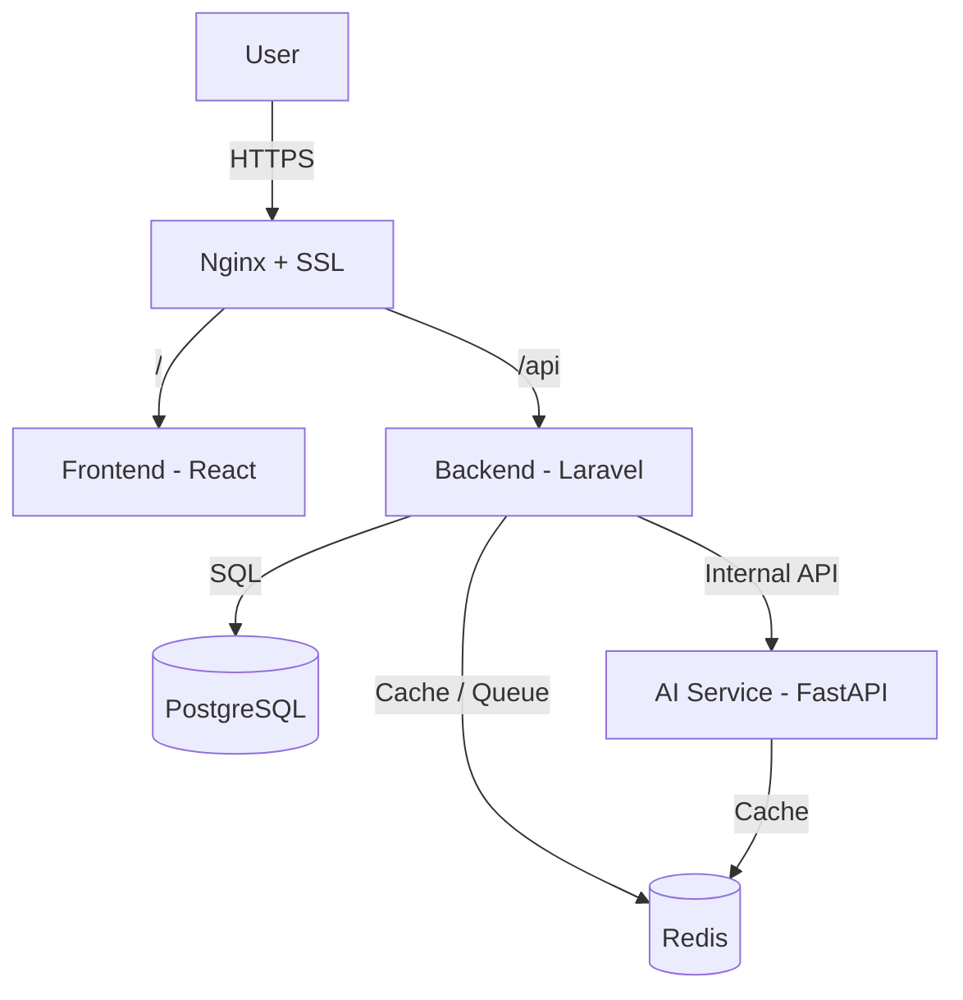

# HƯỚNG DẪN WORKFLOW XÂY DỰNG WEBSITE

Tài liệu hướng dẫn quy trình phát triển cho dự án web gồm 3 vai trò: Backend, Frontend, AI Engineer.

---

## MỤC LỤC

01. Tổng Quan Dự Án
02. Kiến Trúc Hệ Thống
03. Phân Chia Vai Trò
04. Quy Trình Làm Việc Chung
05. Hướng Dẫn Backend
06. Hướng Dẫn Frontend
07. Hướng Dẫn AI Engineer
08. Docker & Docker Compose
09. Nginx & SSL
10. CI/CD
11. Testing
12. Timeline
13. Checklist Trước Khi Launch

---

## 1. Tổng Quan Dự Án

**Tech Stack**

| Thành phần | Công nghệ |
|---|---|
| Frontend | React 18 + Axios |
| Web Server (Frontend) | Nginx |
| Backend | PHP 8.2 + Laravel 11 |
| Application Server | PHP-FPM |
| Database | PostgreSQL 15+ |
| Cache / Queue | Redis 7+ |
| AI Service | Python + FastAPI |
| Containerization | Docker + Docker Compose |
| SSL | Let's Encrypt (Certbot) |
| Reverse Proxy | Nginx + SSL |
| Process Manager | Supervisor |

**Nguyên tắc thiết kế**

01. Mỗi service (Frontend, Backend, AI) là một codebase độc lập, tự build và tự deploy.
02. Giao tiếp giữa các service thực hiện qua API, có hợp đồng (contract) rõ ràng, thống nhất trước khi code.
03. Toàn bộ service chạy trong Docker container, kể cả ở môi trường dev.
04. PostgreSQL do Backend quản lý duy nhất. AI Service không truy cập trực tiếp database, chỉ nhận dữ liệu qua API.

---

## 2. Kiến Trúc Hệ Thống



**Luồng xử lý**

01. Người dùng truy cập qua HTTPS, Nginx tiếp nhận request.
02. Route tĩnh trả về giao diện React.
03. Route `/api/*` chuyển tiếp đến Backend (Laravel).
04. Backend xử lý nghiệp vụ, truy vấn PostgreSQL, dùng Redis cho cache/session.
05. Nếu cần xử lý AI, Backend gọi nội bộ đến AI Service.
06. AI Service xử lý, trả kết quả JSON về Backend, Backend trả về Frontend.

**Ranh giới giữa các service**

01. Frontend chỉ gọi API của Backend, không gọi trực tiếp AI Service.
02. AI Service không expose ra internet, chỉ nhận request nội bộ từ Backend.

---

## 3. Phân Chia Vai Trò

| Vai trò | Phụ trách | Đầu ra |
|---|---|---|
| Backend | API, database, xác thực, tích hợp AI, queue, cache | API có tài liệu, migration, hệ thống auth |
| Frontend | Giao diện, tích hợp API, state management | Giao diện hoàn chỉnh, sẵn sàng deploy |
| AI Engineer | Model AI, API nội bộ, tối ưu hiệu năng | API AI có tài liệu, model đã kiểm thử |

---

## 4. Quy Trình Làm Việc Chung

**Git Workflow**

```
main        - code luôn sẵn sàng deploy
develop     - nhánh tích hợp
feature/*   - mỗi tính năng một nhánh (feature/be-..., feature/fe-..., feature/ai-...)
hotfix/*    - sửa lỗi khẩn cấp
```

01. Commit theo chuẩn: `feat(be): thêm API đăng nhập`.
02. Mọi Pull Request cần ít nhất 1 người review trước khi merge.
03. Không merge khi CI đang fail.

**API Contract**

01. Trước khi code, cả 3 người thống nhất API contract (endpoint, request/response, mã lỗi), lưu trong `API_CONTRACT.md`.
02. Backend chủ trì định nghĩa, nhưng cần thống nhất với Frontend/AI trước khi chốt.
03. Khi contract thay đổi, phải cập nhật tài liệu và thông báo ngay cho nhóm.
04. Frontend và AI có thể dùng mock data để phát triển song song trong lúc chờ Backend.

**Môi trường**

| Môi trường | Mục đích |
|---|---|
| Local | Phát triển trên máy cá nhân qua Docker Compose |
| Staging | Kiểm thử tích hợp trước khi lên production |
| Production | Môi trường chính thức |

01. Mỗi môi trường có file `.env` riêng, không commit `.env` thật lên Git.

**Tài liệu cần duy trì**

01. `README.md`: hướng dẫn chạy toàn bộ hệ thống.
02. `API_CONTRACT.md`: định nghĩa API giữa các service.
03. `CHANGELOG.md`: lịch sử thay đổi.

---

## 5. Hướng Dẫn Backend (PHP + Laravel)

**Cấu trúc chính**

1. Controllers chỉ điều phối, không xử lý logic nghiệp vụ.
2. Services chứa business logic.
3. Requests dùng để validate input.
4. Resources dùng để chuẩn hoá dữ liệu trả về.

**Việc cần làm**

1. Thiết kế database bằng Migration, không sửa DB thủ công.
2. Xây API theo chuẩn RESTful, có versioning (`/api/v1/...`).
3. Chuẩn hoá format response, thống nhất với Frontend.
4. Xác thực bằng Laravel Sanctum, cấu hình CORS đúng domain cho phép.
5. Xây dựng HTTP Client gọi sang AI Service, có timeout hợp lý.
6. Tác vụ nặng đẩy vào Queue (Redis), xử lý bởi Queue Worker.
7. Viết test bằng PHPUnit cho các API quan trọng.

**Checklist theo giai đoạn**

1. Giai đoạn 1: Setup project, kết nối DB/Redis, xác thực cơ bản.
2. Giai đoạn 2: Xây API nghiệp vụ chính, viết test.
3. Giai đoạn 3: Tích hợp AI Service, xử lý queue.
4. Giai đoạn 4: Rà soát bảo mật, tối ưu hiệu năng, chuẩn bị deploy.

---

## 6. Hướng Dẫn Frontend (React 18 + Axios)

**Cấu trúc chính**

1. `api/`: nơi tập trung Axios instance, không gọi API trực tiếp trong component.
2. `components/`: chia theo common, layout, feature.
3. `pages/`: các trang theo route.
4. `hooks/`, `store/`: xử lý logic và state dùng chung.

**Việc cần làm**

1. Tạo Axios instance dùng chung với interceptor để gắn token và xử lý lỗi tập trung.
2. Lưu token an toàn, ưu tiên cookie thay vì localStorage nếu cần bảo mật cao hơn.
3. Xây route bảo vệ cho các trang cần đăng nhập.
4. Với tính năng AI, chỉ gọi API của Backend, thiết kế trạng thái loading rõ ràng cho các tác vụ xử lý lâu.
5. Đảm bảo responsive trên desktop và mobile.
6. Viết test bằng Jest/React Testing Library cho các luồng quan trọng.
7. Build production, cấu hình Nginx serve static và fallback về `index.html`.

**Checklist theo giai đoạn**

1. Giai đoạn 1: Setup project, cấu hình Axios, dựng layout chung.
2. Giai đoạn 2: Xây các trang chính, tích hợp API thật.
3. Giai đoạn 3: Xây giao diện cho tính năng AI.
4. Giai đoạn 4: Responsive, viết test, build production.

---

## 7. Hướng Dẫn AI Engineer (Python + FastAPI)

**Cấu trúc chính**

01. `api/`: router theo version.
02. `schemas/`: Pydantic model cho request/response.
03. `services/`: xử lý nghiệp vụ AI.
04. `models/`: quản lý việc load model.

**Việc cần làm**

1. API AI là API nội bộ, chỉ Backend được gọi, không public ra ngoài.
2. Dùng Pydantic Schema để validate input/output, tận dụng tài liệu OpenAPI tự sinh của FastAPI.
3. Load model một lần khi khởi động service, tránh load lại mỗi request.
4. Cache kết quả inference lặp lại bằng Redis để giảm tải.
5. Với tác vụ xử lý lâu, thiết kế theo mô hình submit job, trả về job ID, client kiểm tra trạng thái.
6. Viết test bằng pytest, đo benchmark thời gian phản hồi.
7. Chuẩn bị endpoint `/health` phục vụ health check.

**Checklist theo giai đoạn**

1. Giai đoạn 1: Setup project, định nghĩa schema, thống nhất contract.
2. Giai đoạn 2: Tích hợp model, xây endpoint chính.
3. Giai đoạn 3: Thêm cache, xử lý bất đồng bộ nếu cần.
4. Giai đoạn 4: Viết test, benchmark, chuẩn bị deploy.

---

## 8. Docker & Docker Compose

**Danh sách service**

| Service | Vai trò |
|---|---|
| `frontend` | Serve giao diện React |
| `backend` | Chạy PHP-FPM cho Laravel |
| `nginx` | Reverse proxy chính |
| `ai-service` | Chạy FastAPI |
| `postgres` | Database |
| `redis` | Cache, session, queue |

**Nguyên tắc**

1. Mỗi service có Dockerfile riêng.
2. Các service giao tiếp qua network nội bộ, chỉ Nginx expose port ra ngoài.
3. Dùng volume để lưu dữ liệu bền vững cho PostgreSQL.
4. Quản lý biến môi trường qua file `.env` riêng cho từng service.

---

## 9. Nginx & SSL

1. Nginx là cổng vào duy nhất của hệ thống, xử lý SSL và phân luồng request.
2. Route `/` về Frontend, route `/api` về Backend. AI Service không có route public.
3. Dùng Certbot để cấp và tự động gia hạn SSL miễn phí.
4. Redirect toàn bộ traffic HTTP sang HTTPS.
5. Bật các security header cơ bản (HSTS, X-Frame-Options).

---

## 10. CI/CD

Mỗi service có pipeline riêng, gồm các bước: Lint, Test, Build, Deploy.

01. Merge vào `develop` tự động deploy staging.
02. Merge vào `main` deploy production, nên có bước duyệt thủ công trước khi deploy.

---

## 11. Testing

| Loại test | Phụ trách | Công cụ |
|---|---|---|
| Unit test | Từng người cho service của mình | PHPUnit, Jest, pytest |
| Integration test | Từng người | Feature test, RTL, FastAPI TestClient |
| Test tích hợp liên service | Backend chủ trì | Postman/Newman |
| End-to-End | Frontend chủ trì | Cypress/Playwright |

Không cho phép merge code nếu test đang fail trong CI.

---

## 12. Timeline

| Giai đoạn | Thời lượng | Nội dung |
|---|---|---|
| Chuẩn bị | 2-3 ngày | Thống nhất kiến trúc, viết API contract, setup repo |
| Foundation | 1 tuần | Setup project, xác thực cơ bản, kết nối DB/Redis |
| Core Features | 2-3 tuần | Xây tính năng nghiệp vụ chính |
| Tích hợp AI | 1-2 tuần | Xây và tích hợp tính năng AI |
| Testing & Tối ưu | 1 tuần | Viết test, tối ưu hiệu năng |
| Staging & UAT | 3-5 ngày | Deploy staging, kiểm thử tổng thể |
| Production Launch | 1-2 ngày | Deploy production, giám sát sau launch |

---

## 13. Checklist Trước Khi Launch

01. SSL hoạt động, redirect HTTP sang HTTPS.
02. Biến môi trường production không dùng giá trị mặc định.
03. AI Service không bị expose public.
04. Migration production đã chạy đầy đủ.
05. Queue worker chạy ổn định qua Supervisor.
06. Build Frontend đã tối ưu, responsive đầy đủ.
07. Model AI đạt yêu cầu về độ trễ và độ chính xác.
08. CI/CD của cả 3 service chạy pass.
09. Đã test luồng tích hợp đầy đủ: Frontend, Backend, AI, Backend, Frontend.
10. Tài liệu `README.md`, `API_CONTRACT.md` đã cập nhật mới nhất.

---

**Nguyên tắc quan trọng nhất**: Mọi thay đổi ảnh hưởng đến API contract giữa 3 người phải được cập nhật tài liệu và thông báo ngay, tránh lỗi tích hợp khó phát hiện.
