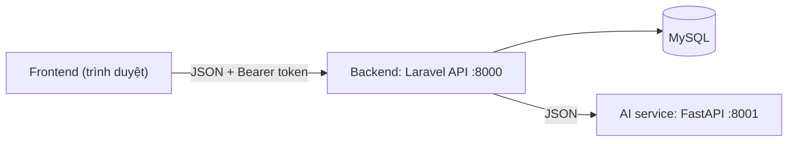

# Website tìm nhà trọ cho sinh viên: Hướng dẫn nhóm

Đây là tài liệu duy nhất mọi người đều phải đọc. Sau đó đọc hợp đồng API của phần mình:

- Frontend: `API_CONTRACT.md`
- AI: `AI_CONTRACT.md`
- Backend: đọc cả hai

## 1. Kiến trúc



Ba nguyên tắc giúp ba phần làm việc độc lập:

1. Frontend chỉ nói chuyện với Backend. **Không bao giờ** gọi thẳng AI service.
2. AI service không truy cập database. Backend gửi cho nó mọi dữ liệu cần thiết.
3. Các file hợp đồng là nguồn sự thật. Nếu cần đổi, hãy sửa file hợp đồng rồi báo cho cả nhóm.

## 2. Ai làm gì

| Vai trò | Xây dựng | Bàn giao |
|---|---|---|
| Backend | Laravel JSON API, MySQL, xác thực, upload file, dữ liệu mẫu, gọi AI service | API chạy được + dữ liệu demo đã seed |
| Frontend | Toàn bộ trang và giao diện, bản đồ Leaflet, gọi API của Backend | Website chạy được |
| AI | FastAPI service với 5 endpoint | AI service chạy được, có chế độ fake |

Phân công theo tính năng:

| Tính năng | Backend | Frontend | AI |
|---|---|---|---|
| Duyệt nhà và lọc | `GET /listings`, dữ liệu mẫu | Form lọc, thẻ nhà, phân trang | |
| Bản đồ | lat/lng trong danh sách nhà | Bản đồ Leaflet từ kết quả `/listings` | |
| Đăng nhập và hồ sơ | `/register` `/login` `/me` `/profile` | Form, lưu token, chặn route cần đăng nhập | |
| Yêu thích | `/favorites` | Nút tim, trang yêu thích | |
| Nhắn tin và tệp | `/conversations...` | Hộp thư, trang chat, upload tệp | |
| Đánh giá | `/listings/{id}/reviews` | Form chấm sao, danh sách đánh giá | |
| Tin đăng của chủ nhà | CRUD tin đăng, ảnh | Form đăng tin, chọn vị trí trên bản đồ, upload ảnh | |
| AI: bạn cùng phòng | `/ai/roommates` (chuẩn bị ứng viên) | Trang kết quả | `POST /roommates` |
| AI: đánh giá giá | `/ai/price-advice` (tính thống kê) | Trang kết quả | `POST /price-advice` |
| AI: gợi ý khu vực | `/ai/area-suggestions` (tính thống kê) | Form + kết quả | `POST /areas` |
| AI: chatbot | `/ai/chat` | Khung chat, giữ lịch sử hội thoại | `POST /chat` + `knowledge.md` |
| AI: tạo mô tả | `/ai/description` | Nút trên form đăng tin | `POST /description` |

## 3. Công nghệ

| Phần | Công nghệ |
|---|---|
| Backend | PHP 8.2+, Laravel 11, MySQL, Laravel Sanctum (xác thực bằng token) |
| Frontend | Tự chọn: React + Vite + Bootstrap 5 + Axios, hoặc HTML/JS thuần + Bootstrap 5. Dùng Leaflet cho bản đồ |
| AI | Python 3.10+, FastAPI. Gọi API LLM bất kỳ hoặc model riêng, tự chọn |

Không cần Docker, Redis, Nginx hay CI. Mỗi người chạy phần của mình trên máy cá nhân.

## 4. Cấu trúc thư mục

Một repo, mỗi người một thư mục cấp 1 riêng, nên ít bị xung đột khi merge.

```
rental-house/
├── docs/                 # README.md, API_CONTRACT.md, AI_CONTRACT.md
├── frontend/             # Frontend phụ trách (cấu trúc tự do)
├── backend/              # Laravel (Backend phụ trách)
│   ├── app/Http/Controllers/
│   ├── app/Models/
│   ├── app/Services/AiClient.php   # gọi sang AI service
│   ├── database/migrations/  database/seeders/
│   └── routes/api.php
├── ai-service/           # FastAPI (AI phụ trách)
│   ├── main.py
│   ├── knowledge.md      # kiến thức cho chatbot
│   └── requirements.txt
└── README.md             # cách chạy toàn bộ hệ thống (ngắn)
```

Mỗi thư mục có `.gitignore` riêng (`vendor/`, `node_modules/`, `venv/`, `.env`).

## 5. Chạy trên máy

| Phần | Cổng | Lệnh |
|---|---|---|
| Backend | 8000 | `composer install`, copy `.env.example` thành `.env`, `php artisan key:generate`, `php artisan migrate --seed`, `php artisan storage:link`, `php artisan serve` |
| AI | 8001 | `pip install -r requirements.txt`, sau đó `uvicorn main:app --port 8001` |
| Frontend | 5173 (hoặc tùy) | `npm install`, `npm run dev` (hoặc mở file HTML bằng một local server) |

Biến môi trường:

| File | Biến |
|---|---|
| `backend/.env` | `DB_*`, `FRONTEND_URL=http://localhost:5173` (cho CORS), `AI_URL=http://localhost:8001` |
| `frontend/.env` | `VITE_API_URL=http://localhost:8000/api` |
| `ai-service/.env` | `LLM_API_KEY=`, `FAKE_MODE=true` |

Không commit file `.env` thật hay API key. Chỉ commit `.env.example`.

## 6. Cách phối hợp

**Git**
- `main` luôn chạy được. Làm việc trên nhánh riêng: `be/...`, `fe/...`, `ai/...`.
- Khi tính năng chạy được thì merge vào `main` và báo cho nhóm. Không push code lỗi lên `main`.
- Commit theo dạng: `feat(be): thêm đăng nhập`, `fix(fe): sửa reset bộ lọc`.

**Làm song song**
- Frontend: khi endpoint chưa có, dùng JSON mẫu copy từ `API_CONTRACT.md`. Khi Backend báo sẵn sàng thì chuyển sang API thật.
- AI: làm khung trước. Trả dữ liệu giả đúng cấu trúc hợp đồng (`FAKE_MODE=true`) để Backend tích hợp sớm, sau đó thay dần bằng logic thật.
- Backend: dữ liệu mẫu và các endpoint đọc dữ liệu làm trước, vì Frontend cần chúng nhất.

## 7. Checklist demo

1. Clone mới về chạy được chỉ bằng cách làm theo mục 5.
2. `php artisan migrate:fresh --seed` tạo dữ liệu demo và các tài khoản sau (mật khẩu `password`): `student1@example.com` ... `student10@example.com`, `landlord1@example.com` ... `landlord3@example.com`.
3. Mọi tính năng ở mục 2 chạy được với các tài khoản demo.
4. `FAKE_MODE=true` cho phép demo AI mà không cần internet hay API key. Giữ làm phương án dự phòng cho ngày thi.
5. Không có bí mật (key, mật khẩu thật) trong repo.
