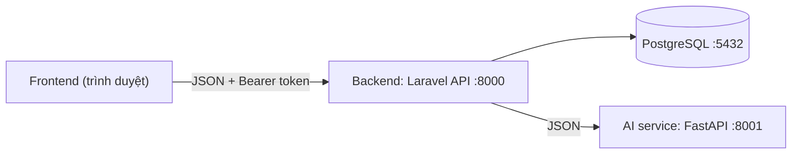

# Website tìm nhà trọ cho sinh viên: Hướng dẫn nhóm

> **Mới vào nhóm?** Bắt đầu từ [docs/ONBOARDING.md](docs/ONBOARDING.md) -
> một trang gộp mọi thứ cần biết: chạy local trong 5 phút, đọc gì theo vai
> trò, quy ước bắt buộc. Trang này là tài liệu tham chiếu chi tiết.

Đây là tài liệu duy nhất mọi người đều phải đọc. Sau đó đọc hợp đồng API của phần mình:

- Frontend: `docs/API_CONTRACT.md`
- AI: `docs/AI_CONTRACT.md`
- Backend: đọc cả hai, cộng thêm `docs/ERD.md` (cơ sở dữ liệu)

## 1. Kiến trúc


```mermaid
graph LR
    FE["Frontend (trình duyệt)"] -->|"JSON + Bearer token"| BE["Backend: Laravel API :8000"]
    BE --> DB[("PostgreSQL :5432")]
    BE -->|"JSON"| AI["AI service: FastAPI :8001"]
```

Ba nguyên tắc giúp ba phần làm việc độc lập:

1. Frontend chỉ nói chuyện với Backend. **Không bao giờ** gọi thẳng AI service.
2. AI service không truy cập database. Backend gửi cho nó mọi dữ liệu cần thiết.
3. Các file hợp đồng là nguồn sự thật. Nếu cần đổi, hãy sửa file hợp đồng rồi báo cho cả nhóm.

## 2. Ai làm gì

| Vai trò | Xây dựng | Bàn giao |
|---|---|---|
| Backend | Laravel JSON API, PostgreSQL, xác thực, upload file, dữ liệu mẫu, gọi AI service | API chạy được + dữ liệu demo đã seed |
| Frontend | Toàn bộ trang và giao diện, bản đồ Leaflet, gọi API của Backend | Website chạy được |
| AI | FastAPI service với 5 endpoint | AI service chạy được, có chế độ fake |

Phân công theo tính năng:

| Tính năng | Backend | Frontend | AI |
|---|---|---|---|
| Duyệt nhà và lọc | `GET /listings`, dữ liệu mẫu | Form lọc, thẻ nhà, phân trang | |
| Bản đồ | lat/lng trong danh sách nhà | Bản đồ Leaflet từ kết quả `/listings` | |
| Đăng nhập và hồ sơ | `/register` `/login` `/me` `/profile` | Form, lưu token, chặn route cần đăng nhập | |
| Yêu thích | `/favorites` | Nút tim, trang yêu thích | |
| Nhắn tin và tệp | `/conversations...` | Hộp thư, trang chat, upload tệp | |
| Đánh giá | `/listings/{id}/reviews` | Form chấm sao, danh sách đánh giá | |
| Tin đăng của chủ nhà | CRUD tin đăng, ảnh | Form đăng tin, chọn vị trí trên bản đồ, upload ảnh | |
| AI: bạn cùng phòng | `/ai/roommates` (chuẩn bị ứng viên) | Trang kết quả | `POST /roommates` |
| AI: đánh giá giá | `/ai/price-advice` (tính thống kê) | Trang kết quả | `POST /price-advice` |
| AI: gợi ý khu vực | `/ai/area-suggestions` (tính thống kê) | Form + kết quả | `POST /areas` |
| AI: chatbot | `/ai/chat` | Khung chat, giữ lịch sử hội thoại | `POST /chat` + `knowledge.md` |
| AI: tạo mô tả | `/ai/description` | Nút trên form đăng tin | `POST /description` |

## 3. Công nghệ

| Phần | Công nghệ |
|---|---|
| Backend | PHP 8.3, Laravel 11, PostgreSQL 16, Laravel Sanctum (xác thực bằng token) |
| Frontend | React 18 + TypeScript strict + Vite + Bootstrap 5 + Axios (Node 22 theo `.nvmrc`). Dùng Leaflet cho bản đồ |
| AI | Python 3.10+, FastAPI. Gọi API LLM bất kỳ hoặc model riêng, tự chọn |
| Hạ tầng | Docker Compose với image Debian trixie (`node:22-trixie`, `nginx:1.29-trixie`, `php:8.3-cli-trixie`, `postgres:16-trixie`; Caddy 2 cho TLS ở production). CI GitHub Actions (backend/frontend/secrets) + deploy tự động khi `stable` xanh |

## 4. Cấu trúc thư mục

Một repo, mỗi người một thư mục cấp 1 riêng, nên ít bị xung đột khi merge.

```
rental-house/
├── docker-compose.yml    # PostgreSQL + Backend + Frontend + AI (AI đằng sau profile `ai`)
├── .env.example          # biến cho docker compose (copy thành .env)
├── docs/                 # API_CONTRACT.md, AI_CONTRACT.md, ERD.md
├── frontend/             # Frontend phụ trách (cấu trúc tự do)
├── backend/              # Laravel (Backend phụ trách)
│   ├── Dockerfile  .dockerignore
│   ├── app/Http/Controllers/
│   ├── app/Models/
│   ├── app/Services/AiClient.php   # gọi sang AI service
│   ├── database/migrations/  database/seeders/
│   └── routes/api.php
├── ai-service/           # FastAPI (AI phụ trách) - hiện là stub, chỉ có HANDOFF.md
│   │                     # (kế hoạch: main.py, knowledge.md, requirements.txt)
└── README.md             # chính là file hướng dẫn nhóm này
```

Mỗi thư mục có `.gitignore` riêng (`vendor/`, `node_modules/`, `venv/`, `.env`). `.gitignore` ở gốc repo cũng cần có dòng `.env`.

## 5. Chạy trên máy

Có hai cách: **Docker** (khuyên dùng - một file `docker-compose.yml` duy nhất
dùng cho dev, demo và production) hoặc **không Docker** (PHP + Node trực
tiếp, nhanh nhất khi code hằng ngày).

### Cách A: Docker (khuyên dùng)

```bash
bash deploy.sh --docker     # tự tạo .env + APP_KEY, up -d --build, chờ healthy
# hoặc làm tay:
cp .env.example .env        # điền APP_KEY (lệnh tạo có sẵn trong file)
docker compose up -d --build
```

Cần cài Docker (trên Linux không root có thể dùng Podman: `systemctl --user
enable --now podman.socket` rồi thay `docker` bằng `podman compose`).

| Dịch vụ | Địa chỉ |
|---|---|
| Web (SPA) | http://localhost:5174 |
| API | http://localhost:8000/api (hoặc same-origin http://localhost:5174/api) |
| WebSocket | ws://localhost:8080 (Reverb) |
| AI service (stub FAKE_MODE) | http://localhost:8001/docs - bật bằng `docker compose --profile ai up -d` |
| PostgreSQL | không publish ra host - truy vấn bằng `docker compose exec db psql -U rental -d rental` |

Dữ liệu demo: đặt `SEED_ON_BOOT=1` trong `.env`, hoặc chạy tay
`docker compose exec backend php artisan migrate:fresh --seed --force`.

Lệnh hay dùng:
- `docker compose logs -f backend`: xem log.
- `docker compose down`: tắt (giữ DB + uploads trong volume).
- `docker compose down -v`: tắt và **xóa cả DB + uploads** (làm lại từ đầu).
- Production VPS: xem [docs/DEMO-VPS.md](docs/DEMO-VPS.md) - thêm
  `--profile tls` và `DOMAIN` vào `.env`, Caddy tự cấp HTTPS.

### Cách B: Không dùng Docker

Cần PHP 8.3, Composer, Node 22 và PostgreSQL 16 cài sẵn trên máy (Debian:
`sudo apt-get install -y php-cli php-pgsql php-mbstring php-xml php-zip composer nodejs npm postgresql`).

```bash
bash deploy.sh           # kiểm tra deps, migrate:fresh --seed, chạy
                         # backend :8000 + reverb :8080 + vite :5173
bash deploy.sh --quick   # lần sau: giữ DB, chỉ khởi động lại
```

AI service chạy kèm (tùy chọn): `pip install -r ai-service/requirements.txt`
rồi `uvicorn main:app --port 8001` trong `ai-service/`.

### Biến môi trường

| File | Dùng cho |
|---|---|
| `.env` (gốc repo, docker compose tự đọc) | `APP_KEY` + `REVERB_APP_*` (bắt buộc), `DOMAIN`/`FRONTEND_URL`/`WS_HOST` (production), `SEED_ON_BOOT`, `DB_PASSWORD`, `FAKE_MODE`. Mẫu đầy đủ: `.env.example` |
| `backend/.env` | khi chạy backend ngoài Docker: copy từ `backend/.env.example`, `DB_CONNECTION=pgsql`, `DB_HOST=127.0.0.1`, rồi `php artisan key:generate` |
| `frontend/.env` | dev Vite ngoài Docker: `VITE_API_URL=http://localhost:8000/api` |
| `ai-service/.env` (tùy chọn) | `FAKE_MODE=true`, `LLM_API_KEY=` |

Không commit file `.env` thật hay API key. Chỉ commit `.env.example`.

### Lỗi thường gặp

- Container `unhealthy`: `docker compose logs backend` - production fail-fast
  in dòng `Refusing to serve: ...` nếu `APP_DEBUG=true` hoặc thiếu `APP_KEY`.
- Backend không nối được DB khi chạy ngoài Docker: `DB_HOST=127.0.0.1`
  (không phải `db`).
- Ảnh không hiện: kiểm tra `APP_URL` khớp origin đang truy cập
  (`storage:link` đã chạy tự động khi boot trong Docker).
- Frontend gọi sai địa chỉ API: bundle bake `VITE_*` lúc **build** - đổi
  `.env` xong phải `docker compose up -d --build frontend`, restart không đủ.

## 6. Cách phối hợp

**Git** - mô hình 2 nhánh (stable/unstable)
- `unstable` là nhánh tích hợp: làm việc trên nhánh riêng (`be/...`, `fe/...`, `ai/...`) rồi merge vào `unstable`. Không push code lỗi.
- `stable` là nhánh release: chỉ cập nhật qua PR từ `unstable` sau khi CI xanh. Push vào `stable` sẽ tự động deploy lên VPS (xem `.github/workflows/deploy.yml`).
- Hotfix: sửa trên nhánh phụ, merge vào `unstable`, rồi PR sang `stable`. Không sửa trực tiếp trên `stable`.
- Commit theo dạng: `feat(be): thêm đăng nhập`, `fix(fe): sửa reset bộ lọc`.

**Làm song song**
- Frontend: khi endpoint chưa có, dùng JSON mẫu copy từ `API_CONTRACT.md`. Khi Backend báo sẵn sàng thì chuyển sang API thật.
- AI: làm khung trước. Trả dữ liệu giả đúng cấu trúc hợp đồng (`FAKE_MODE=true`) để Backend tích hợp sớm, sau đó thay dần bằng logic thật.
- Backend: dữ liệu mẫu và các endpoint đọc dữ liệu làm trước, vì Frontend cần chúng nhất.

## 7. Checklist demo

1. Clone mới về chạy được chỉ bằng cách làm theo mục 5.
2. `php artisan migrate:fresh --seed` tạo dữ liệu demo và các tài khoản sau (mật khẩu `password`): `student1@example.com` ... `student10@example.com`, `landlord1@example.com` ... `landlord3@example.com`.
3. Mọi tính năng ở mục 2 chạy được với các tài khoản demo.
4. `FAKE_MODE=true` cho phép demo AI mà không cần internet hay API key. Giữ làm phương án dự phòng cho ngày thi.
5. Không có bí mật (key, mật khẩu thật) trong repo.
