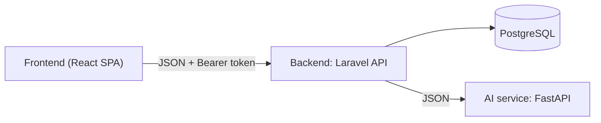

# TROSV

Website tìm phòng trọ gần trường cho sinh viên: duyệt tin, xem bản đồ,
lọc theo trường và phường, nhắn tin trực tiếp với chủ trọ, yêu thích,
đánh giá, và các gợi ý AI (bạn cùng phòng, tư vấn giá, gợi ý khu vực,
trợ lý chat).

## Tính năng

| Tính năng | Ghi chú |
|---|---|
| Duyệt và lọc phòng | Từ khóa, loại tin, giá, khu vực (tỉnh/TP → phường), gần trường (bán kính km), tiện ích, sắp xếp |
| Bản đồ | Leaflet, điểm tin đăng + trường, lọc theo bán kính |
| Tài khoản | Sinh viên / chủ nhà, hồ sơ sở thích và lối sống |
| Nhắn tin | Chat realtime (WebSocket), gửi tệp đính kèm, đánh dấu đã đọc |
| Đánh giá | Chỉ sinh viên đã nhắn tin với chủ nhà mới được đánh giá |
| AI | Gợi ý bạn cùng phòng, tư vấn giá, gợi ý khu vực, chatbot, viết mô tả tin đăng |
| Phân quyền | API chặn theo vai trò; người ngoài không nhìn thấy dữ liệu không công khai |

## Kiến trúc


```mermaid
graph LR
    FE["Frontend (React SPA)"] -->|"JSON + Bearer token"| BE["Backend: Laravel API"]
    BE --> DB[(PostgreSQL)]
    BE -->|JSON| AI["AI service: FastAPI"]
```

- Frontend chỉ gọi Backend. Backend proxy sang AI service.
- AI service không chạm database, không cần LLM key khi chạy demo
  (`FAKE_MODE=true` trả dữ liệu mẫu đúng hợp đồng; backend tự trả 503
  lịch sự khi AI chết).

## Chạy trên máy

Cần Docker (hoặc Podman) trên Debian. Chi tiết đầy đủ trong
[docs/DEPLOY.md](docs/DEPLOY.md).

```bash
cp .env.example .env    # điền APP_KEY (lệnh tạo có sẵn trong file)
docker compose up -d --build
```

| Dịch vụ | Địa chỉ |
|---|---|
| Web | http://localhost:5174 |
| API | http://localhost:5174/api (same-origin) hoặc :8000/api |
| AI service (tùy chọn) | `docker compose --profile ai up -d` → :8001/docs |

Dữ liệu demo: đặt `SEED_ON_BOOT=1` trong `.env`, hoặc chạy tay
`docker compose exec backend php artisan migrate:fresh --seed --force`.
Tài khoản demo (mật khẩu `password`): `student1@example.com` (sinh viên),
`landlord1@example.com` (chủ nhà).

Lệnh hay dùng:

```bash
docker compose logs -f backend     # log
docker compose down                # tắt, giữ dữ liệu
docker compose down -v             # tắt và XÓA dữ liệu
```

Chạy không Docker (PHP + Node trực tiếp): `bash deploy.sh` (lần sau thêm
`--quick` để giữ DB).

## Kiểm thử

| Lệnh | Phạm vi |
|---|---|
| `php artisan test` (trong thư mục `backend/`) | 210+ Feature test, gồm ma trận phân quyền |
| `./vendor/bin/pint --test` | Code style backend |
| `npm run lint && npm run build` (thư mục `frontend/`) | ESLint + kiểm CSS + TypeScript strict + build |
| `npx playwright test` (thư mục `frontend/`) | E2E trình duyệt thật, cần API :8000 + web :4173 |
| `bash frontend/e2e-smoke.sh` | Smoke mọi API theo luồng người dùng, AI tắt vẫn xanh |

CI (GitHub Actions) chạy đủ 4 job: backend, frontend, e2e, quét secret.
Merge vào `stable` khi xanh là tự động deploy.

## Git

- `unstable`: nhánh tích hợp. Làm trên nhánh riêng (`be/...`, `fe/...`,
  `ai/...`) rồi merge vào đây.
- `stable`: nhánh release. Chỉ cập nhật qua PR từ `unstable` sau khi CI
  xanh; merge là deploy tự động.
- Commit: conventional, tiếng Việt không dấu, gọn một dòng
  (`fix(fe): ...`, `feat(be): ...`).

## Tài liệu

| File | Nội dung | Đọc khi |
|---|---|---|
| [docs/API_CONTRACT.md](docs/API_CONTRACT.md) | Hợp đồng API: endpoint, shape JSON, mã lỗi | Làm backend/frontend - nguồn sự thật, đổi API phải sửa đây trước |
| [docs/AI_CONTRACT.md](docs/AI_CONTRACT.md) | Hợp đồng giữa Backend và AI service | Làm AI service |
| [docs/ERD.md](docs/ERD.md) | Cơ sở dữ liệu: bảng, quan hệ, dữ liệu seed | Làm backend, sửa migration |
| [docs/ONBOARDING.md](docs/ONBOARDING.md) | Onboarding người mới | Ngày đầu vào nhóm |
| [docs/DEPLOY.md](docs/DEPLOY.md) | Deploy lên máy chủ Debian | Triển khai production |
| [SECURITY.md](SECURITY.md) | Chính sách bảo mật, cách báo cáo lỗ hổng | Báo cáo hoặc tìm hiểu biện pháp bảo mật |
| [docs/TECH-DEBT.md](docs/TECH-DEBT.md) | Sổ nợ kỹ thuật và quy trình theo dõi | Trước khi refactor |
| [scripts/RESTORE.md](scripts/RESTORE.md) | Quy trình restore từ backup | Khi cần khôi phục dữ liệu |
| [scripts/ROLLBACK.md](scripts/ROLLBACK.md) | Quy trình rollback code | Khi deployment lỗi |

## Cấu trúc

```
trosv/
├── docker-compose.yml   # DB + backend + frontend + reverb + queue + scheduler
│                        # (+ caddy khi profile tls, + ai-service khi profile ai)
├── .env.example
├── docs/                # hợp đồng API/AI, ERD, deploy, onboarding
├── frontend/            # React SPA (TypeScript strict, Vite, Bootstrap 5, Leaflet)
├── backend/             # Laravel API (PHP 8.3, PostgreSQL 16, Sanctum)
├── ai-service/          # FastAPI (stub FAKE_MODE)
└── scripts/             # backup, restore, rollback
```
