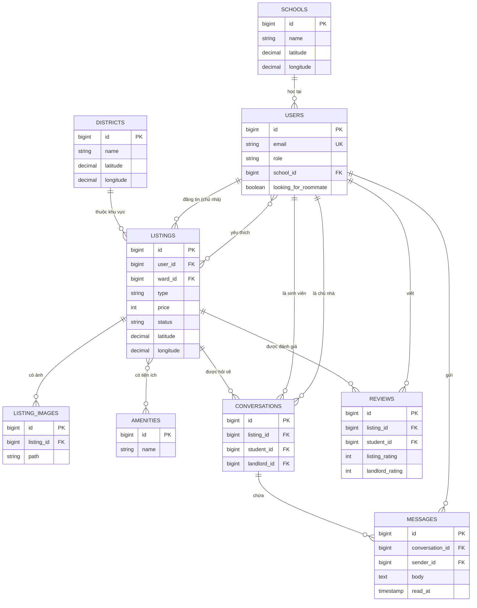

# ERD: Cơ sở dữ liệu (PostgreSQL)

Tài liệu này dành cho **Backend**. Dùng file này để viết migration, model và seeder.

## 1. Quy ước

- PostgreSQL 16, chỉ Backend truy cập database. Mọi thay đổi cấu trúc đều thông qua migration của Laravel, không sửa tay.
- Tên bảng số nhiều, `snake_case`. Bảng nào có `timestamps` thì dùng `created_at`, `updated_at` của Laravel.
- Tiền là số nguyên VND (`unsignedInteger`, tối đa 2,1 tỷ là đủ). Tọa độ dùng `decimal(10,7)`.
- Giá trị enum lưu bằng `string` và kiểm tra trong code (validation). **Không** dùng kiểu `ENUM` của PostgreSQL.
- Khóa ngoại dùng `cascadeOnDelete()` (xóa cha thì xóa con), riêng `users.school_id` dùng `nullOnDelete()`.
- Không lưu điểm đánh giá trung bình, luôn tính khi cần (xem mục 4).

## 2. Sơ đồ ERD



Hai quan hệ nhiều-nhiều là hai bảng nối: `amenity_listing` (tin đăng - tiện ích) và `favorites` (sinh viên - tin đăng).

## 3. Chi tiết các bảng (11 bảng)

### users

| Cột | Kiểu | Ghi chú |
|---|---|---|
| id | bigint, PK | |
| name | string(100) | |
| email | string(255), unique | Lưu chữ thường |
| password | string | |
| role | string(20) | `student` hoặc `landlord` |
| phone | string(20), null | |
| bio | text, null | |
| school_id | bigint, null, FK schools | Chỉ sinh viên |
| budget_min, budget_max | unsignedInteger, null | Chỉ sinh viên. `budget_max >= budget_min` |
| sleep_schedule | string(10), null | `early`, `normal`, `late`. Chỉ sinh viên |
| cleanliness | tinyInteger, null | 1 đến 5. Chỉ sinh viên |
| smoking | boolean, null | Chỉ sinh viên |
| personality | string(15), null | `introvert`, `ambivert`, `extrovert`. Chỉ sinh viên |
| interests | string(255), null | Chuỗi ngăn cách bằng dấu phẩy. Chỉ sinh viên |
| looking_for_roommate | boolean, mặc định false | Chỉ sinh viên |
| remember_token, timestamps | | Có sẵn của Laravel |

Sửa migration `users` mặc định của Laravel để có các cột trên. Bảng `schools` phải được tạo **trước** bảng `users` (đặt tên file migration có mốc thời gian sớm hơn).

### schools và wards (cùng cấu trúc)

| Cột | Kiểu |
|---|---|
| id | bigint, PK |
| name | string(200) |
| latitude, longitude | decimal(10,7) |

### amenities

| Cột | Kiểu |
|---|---|
| id | bigint, PK |
| name | string(100) |

### listings

| Cột | Kiểu | Ghi chú |
|---|---|---|
| id | bigint, PK | |
| user_id | bigint, FK users | Chủ nhà |
| ward_id | bigint, FK wards | |
| title | string(200) | |
| description | text, null | |
| type | string(20) | `room`, `apartment`, `house` |
| price | unsignedInteger | VND/tháng, từ 100000 đến 100000000 |
| area_m2 | decimal(6,1) | |
| address | string(300) | |
| latitude, longitude | decimal(10,7) | Chủ nhà chọn trên bản đồ |
| status | string(20), mặc định `available` | `available`, `rented`, `hidden` |
| timestamps | | |

Index: `(status, price)`, `(ward_id)`.

### amenity_listing (bảng nối)

`listing_id` (FK), `amenity_id` (FK). Khóa chính kép `(listing_id, amenity_id)`.

### listing_images

| Cột | Kiểu | Ghi chú |
|---|---|---|
| id | bigint, PK | |
| listing_id | bigint, FK listings | |
| path | string(500) | Đường dẫn trên disk `public`. Ảnh có `id` nhỏ nhất là ảnh bìa |

Tối đa 5 ảnh mỗi tin (kiểm tra trong code).

### favorites (bảng nối)

`user_id` (FK users), `listing_id` (FK listings). Khóa chính kép `(user_id, listing_id)`.

### conversations

| Cột | Kiểu | Ghi chú |
|---|---|---|
| id | bigint, PK | |
| listing_id | bigint, FK listings | |
| student_id | bigint, FK users | |
| landlord_id | bigint, FK users | Sao chép từ `listings.user_id` lúc tạo |
| timestamps | | |

Unique `(listing_id, student_id)`: mỗi sinh viên chỉ có một hội thoại cho mỗi tin.

### messages

| Cột | Kiểu | Ghi chú |
|---|---|---|
| id | bigint, PK | Tăng dần, dùng cho `after_id` |
| conversation_id | bigint, FK conversations | |
| sender_id | bigint, FK users | |
| body | text | Được rỗng khi chỉ gửi tệp |
| attachment_path | string(500), null | Lưu ở disk riêng tư (`local`), không công khai |
| attachment_name | string(255), null | Tên tệp gốc |
| read_at | timestamp, null | Thời điểm người nhận đọc |
| timestamps | | |

Index: `(conversation_id, id)`.

### reviews

| Cột | Kiểu | Ghi chú |
|---|---|---|
| id | bigint, PK | |
| listing_id | bigint, FK listings | |
| student_id | bigint, FK users | |
| listing_rating | tinyInteger | 1 đến 5 |
| landlord_rating | tinyInteger | 1 đến 5 |
| comment | text, null | |
| timestamps | | |

Unique `(listing_id, student_id)`: mỗi sinh viên đánh giá một tin đúng một lần.

## 4. Quy tắc và truy vấn cần nhớ

**Điểm đánh giá** (tính khi cần, không lưu):
- `listing_avg` = trung bình `listing_rating` của tin đó (dùng `withAvg('reviews', 'listing_rating')`).
- `landlord_avg` = trung bình `landlord_rating` của mọi đánh giá thuộc các tin của chủ nhà đó.
- `area_avg` = trung bình `listing_rating` của mọi đánh giá thuộc các tin cùng `ward_id`.

**Điều kiện được đánh giá** (`can_review`): người dùng là sinh viên, đã có hội thoại về tin đó, và chưa đánh giá tin đó.

**Khoảng cách tới trường** (km, Haversine), tính trực tiếp bằng SQL. Thứ tự tham số: vĩ độ trường, kinh độ trường, vĩ độ trường:

```
6371 * ACOS(LEAST(1, COS(RADIANS(CAST(? AS float8))) * COS(RADIANS(latitude)) * COS(RADIANS(longitude) - RADIANS(CAST(? AS float8))) + SIN(RADIANS(CAST(? AS float8))) * SIN(RADIANS(latitude))))
```

Dùng `selectRaw(... AS distance_km)` để hiển thị và `whereRaw` với cùng biểu thức để lọc `max_km` (không dùng HAVING, để `paginate()` chạy đúng).

**Khác biệt PostgreSQL so với MySQL** (dễ sai khi chuyển):
1. `LIKE` phân biệt hoa thường. Tìm kiếm `q` dùng `ILIKE`: `->where('title', 'ilike', "%{$q}%")`.
2. Tham số trong công thức khoảng cách phải ép kiểu `CAST(? AS float8)` như trên.
3. Không có `unsigned`. Laravel vẫn chấp nhận `unsignedInteger` nhưng thực tế là `integer`.
4. Nếu seeder chèn `id` cố định, phải reset sequence (`SELECT setval(...)`) để lần chèn sau không bị trùng khóa. Dùng factory/tự tăng thì không cần.
5. Kiểu `boolean` là true/false thật, không phải 0/1.

## 5. Dữ liệu mẫu (seeder)

Dữ liệu trải khắp Việt Nam (các thành phố nhiều sinh viên):

| Bảng | Nội dung |
|---|---|
| wards | 16 phường/xã: Hà Nội (4), TP.HCM (4), Đà Nẵng (2), Cần Thơ (2), Huế, Nha Trang, Quy Nhơn, Nghệ An |
| schools | 13 trường ĐH: Hà Nội (3), TP.HCM (3), Đà Nẵng (2), Cần Thơ, Huế, Nha Trang, Quy Nhơn, Vinh |
| amenities | Wifi, Máy lạnh, Máy nước nóng, Máy giặt, Tủ lạnh, Bếp, WC riêng, Chỗ để xe, Bảo vệ, Giờ giấc tự do |
| users | 3 chủ nhà, 10 sinh viên (hồ sơ điền đủ, phần lớn `looking_for_roommate = true`). Mật khẩu chung `password`. Email theo mẫu `student1@example.com`, `landlord1@example.com` |
| listings | 30 tin, đủ 3 loại, giá 1,5 đến 6 triệu, tọa độ quanh tâm khu vực, 3 đến 6 tiện ích mỗi tin, mỗi tin 1 ảnh mẫu lưu cục bộ, vài tin `rented` |
| khác | Vài hội thoại có tin nhắn, vài đánh giá |

Chạy: `php artisan migrate:fresh --seed`.
