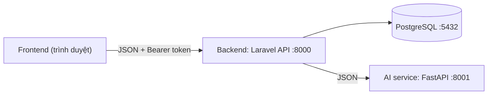

# Onboarding - người mới đọc 1 trang này

Mục tiêu: trong ~15 phút bạn biết dự án là gì, chạy được local, và biết
đọc đúng tài liệu cho vai trò của mình. Phần còn lại của docs là tài liệu
tra cứu, không cần đọc hết ngay.

## 1. Dự án là gì

TROSV - nền tảng tìm nhà trọ cho sinh viên Việt Nam: duyệt phòng trên bản
đồ, yêu thích, nhắn tin trực tiếp với chủ nhà (kèm file đính kèm), đánh
giá, và các gợi ý AI (khu vực, bạn cùng phòng, trợ lý chat).



Ba nguyên tắc: Frontend **chỉ** nói chuyện với Backend · AI service không
chạm database · file hợp đồng là nguồn sự thật (đổi gì phải sửa hợp đồng
trước rồi báo cả nhóm).

## 2. Chạy local trong 5 phút

Cách nhanh nhất (Docker - không cần cài PHP/Node/PostgreSQL trên máy):

```bash
bash deploy.sh --docker   # tự tạo .env + APP_KEY, build, chờ healthy
```

Hoặc không Docker (PHP + Node trực tiếp trên Debian/Ubuntu):

```bash
bash deploy.sh          # deps check + DB mới + backend :8000 + vite :5173 + reverb :8080
bash deploy.sh --quick  # lần sau: giữ DB, chỉ khởi động lại
```

- Web: http://localhost:5174 (Docker) hoặc http://localhost:5173 (Vite dev)
  · API: http://localhost:8000/api
- Tài khoản demo (mật khẩu `password`): `student1@example.com` (sinh
  viên), `landlord1@example.com` (chủ nhà). Docker: đặt `SEED_ON_BOOT=1`
  trong `.env` để có dữ liệu demo khi boot.
- AI service (:8001, `docker compose --profile ai up -d`) không bắt buộc -
  là stub FAKE_MODE; backend tự trả 503 lịch sự khi AI chết, mọi tính năng
  còn lại chạy bình thường.

Smoke test: `bash frontend/e2e-smoke.sh` (~70 check trên mọi API call,
chạy được cả khi AI service tắt) - API xanh là đủ để bắt đầu code.

## 3. Đọc gì tiếp theo, theo vai trò

| Vai trò | Bắt buộc | Tham khảo khi cần |
|---|---|---|
| Mọi người | [README.md](../README.md) (kiến trúc + phân công) | [PLAN.md](../PLAN.md) (lộ trình các phase) |
| Backend | [docs/API_CONTRACT.md](API_CONTRACT.md) + [docs/ERD.md](ERD.md) | [docs/TECH-DEBT.md](TECH-DEBT.md), [PROMPTS.md](../PROMPTS.md) (bối cảnh từng bước dựng) |
| Frontend | [docs/API_CONTRACT.md](API_CONTRACT.md) + [frontend/README.md](../frontend/README.md) | [docs/TECH-DEBT.md](TECH-DEBT.md) |
| AI | [docs/AI_CONTRACT.md](AI_CONTRACT.md) | [docs/ERD.md](ERD.md) (backend gửi những gì) |
| Triển khai/demo | [docs/DEMO-VPS.md](DEMO-VPS.md) (chạy VPS bằng Docker) | [SECURITY.md](../SECURITY.md) |

## 4. Quy ước bắt buộc (đọc 1 lần, tránh review Iterate)

- **Hợp đồng API trước tiên**: shape JSON, mã lỗi, message tiếng Việt phải
  khớp `docs/API_CONTRACT.md`. Người ngoài bị chặn nhận **404** (không lộ
  tồn tại), lỗi validation luôn 422 `{ message, errors }`.
- **Mass assignment**: không bao giờ cho `role` qua request; field sinh
  viên/chủ nhà phân tách bằng FormRequest riêng theo vai trò.
- **Test trước khi push**: backend
  `php artisan test` (209 test) + `./vendor/bin/pint --test`; frontend
  `npm run lint && npm run build`. CI (backend/frontend/secrets) phải xanh.
- **Commit**: conventional, tiếng Việt không dấu, gọn một dòng ý nghĩa
  (`refactor: tach useAuthForm dung chung...`).
- **Không commit secret**: `.env` đã ignore; CI có job gitleaks quét mỗi push.

## 5. Bảo mật & production (tóm tắt 1 màn hình)

Chi tiết đầy đủ: [SECURITY.md](../SECURITY.md) + section hardening trong
[docs/DEMO-VPS.md](DEMO-VPS.md). Những gì bạn sẽ gặp:

- Backend production **từ chối phục vụ** (500 chung, lý do trong log dòng
  `Refusing to serve: ...`) nếu `APP_DEBUG=true` hoặc thiếu `APP_KEY`.
- CSP **enforcing** theo loại response; sửa `welcome.blade.php` (trang HTML
  duy nhất backend render) thì xem `app/Http/Middleware/SecurityHeaders.php`.
- Token đăng nhập hết hạn sau 30 ngày (`SANCTUM_TOKEN_TTL_MINUTES`).
- File đính kèm chat là file **riêng tư** - chỉ mở qua URL ký 60 phút;
  tin đã "thu hồi" thì URL chết ngay.

## 6. Bản đồ thư mục

```
backend/    Laravel API
  app/Http/Controllers    Auth/, AI proxy, Listing, Conversation, ...
  app/Http/Requests       FormRequest validate (mỗi endpoint một file)
  app/Http/Resources      Shape JSON ra ngoài (đối chiếu API_CONTRACT §3)
  app/Http/Middleware     throttle, role, security headers, ...
  app/Models|Policies     Eloquent + quyền (outsider = 404)
  routes/api.php          toàn bộ endpoint + throttle
  tests/Feature/          209 test, gồm authorization matrix
frontend/   React 18 + TypeScript strict SPA (Vite + Bootstrap 5 + Leaflet,
            Node 22 theo .nvmrc)
  src/api/                axios client + hàm gọi API theo nhóm
  src/pages/              mỗi trang một thư mục
  src/components/         UI dùng chung (auth/, conversation/, ui/)
  src/hooks/              useAuthForm, useListingForm, useListingPage, ...
  src/constants/          routes.ts (SPA routes), events.ts, hobbies.ts
  src/styles/             theme → layout → chrome → auth → messages →
                          chat → widgets → components (thứ tự load-bearing)
docs/       hợp đồng + runbook + sổ tech debt
```

Sửa gì cũng nhớ: hợp đồng trước, code sau, test kèm theo.
