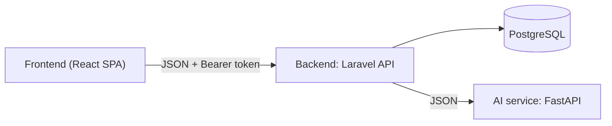

# Onboarding

Mục tiêu: trong 15 phút bạn chạy được dự án và biết cần đọc gì. Phần còn
lại là tài liệu tra cứu, không cần đọc hết ngay.

## 1. Dự án là gì

TROSV - website tìm phòng trọ gần trường cho sinh viên: duyệt phòng trên
bản đồ, yêu thích, nhắn tin trực tiếp với chủ trọ (kèm tệp đính kèm),
đánh giá, và các gợi ý AI (khu vực, bạn cùng phòng, trợ lý chat).



Ba nguyên tắc: Frontend **chỉ** gọi Backend · AI service không chạm
database · file hợp đồng trong `docs/` là nguồn sự thật - đổi gì phải sửa
hợp đồng trước, rồi báo cả nhóm.

## 2. Chạy local

Cần Docker (hoặc Podman) trên Debian:

```bash
cp .env.example .env     # điền APP_KEY (lệnh tạo có sẵn trong file)
docker compose up -d --build
```

- Web: http://localhost:5174 · API: http://localhost:5174/api
- Dữ liệu demo: `SEED_ON_BOOT=1` trong `.env` (đặt trước khi boot), hoặc
  `docker compose exec backend php artisan migrate:fresh --seed --force`
- Tài khoản demo (mật khẩu `password`): `student1@example.com` (sinh
  viên), `landlord1@example.com` (chủ nhà)
- AI service là stub FAKE_MODE, không bắt buộc: `docker compose --profile
  ai up -d`. AI tắt thì backend tự trả 503, mọi tính năng còn lại chạy bình thường.

Chạy không Docker (PHP + Node trực tiếp): `bash deploy.sh` (lần sau thêm
`--quick`).

Smoke nhanh API: `bash frontend/e2e-smoke.sh` - xanh là đủ để bắt đầu code.

## 3. Đọc gì tiếp theo, theo vai trò

| Vai trò | Bắt buộc | Tham khảo khi cần |
|---|---|---|
| Mọi người | [README.md](../README.md) | [PLAN.md](../PLAN.md), [docs/TECH-DEBT.md](TECH-DEBT.md) |
| Backend | [docs/API_CONTRACT.md](API_CONTRACT.md) + [docs/ERD.md](ERD.md) | [PROMPTS.md](../PROMPTS.md) |
| Frontend | [docs/API_CONTRACT.md](API_CONTRACT.md) + [frontend/README.md](../frontend/README.md) | [docs/TECH-DEBT.md](TECH-DEBT.md) |
| AI | [docs/AI_CONTRACT.md](AI_CONTRACT.md) | [docs/ERD.md](ERD.md) |
| Triển khai | [docs/DEPLOY.md](DEPLOY.md) | [SECURITY.md](../SECURITY.md), [scripts/RESTORE.md](../scripts/RESTORE.md) |

## 4. Quy ước bắt buộc

- **Hợp đồng API trước tiên**: shape JSON, mã lỗi, message tiếng Việt phải
  khớp `docs/API_CONTRACT.md`. Người ngoài bị chặn nhận **404** (không lộ
  tồn tại), lỗi validation luôn 422 `{ message, errors }`.
- **Mass assignment**: không bao giờ cho `role` qua request; field sinh
  viên/chủ nhà phân tách bằng FormRequest riêng theo vai trò.
- **Test trước khi push**: backend `php artisan test` + `./vendor/bin/pint
  --test`; frontend `npm run lint && npm run build`. CI cả 4 job phải xanh.
- **Commit**: conventional, tiếng Việt không dấu, gọn một dòng ý nghĩa.
- **Không commit secret**: `.env` đã ignore; CI có job gitleaks quét mỗi push.

## 5. Bản đồ thư mục

```
backend/    Laravel API
  app/Http/Controllers     Auth/, AI proxy, Listing, Conversation, ...
  app/Http/Requests        FormRequest validate (mỗi endpoint một file)
  app/Http/Resources       Shape JSON ra ngoài (đối chiếu API_CONTRACT §3)
  app/Http/Middleware      throttle, role, security headers, ...
  app/Models|Policies      Eloquent + quyền (outsider = 404)
  routes/api.php           toàn bộ endpoint + throttle
  tests/Feature/           210+ test, gồm ma trận phân quyền
frontend/   React 18 + TypeScript strict SPA (Vite, Bootstrap 5, Leaflet)
  src/api/                 axios client + hàm gọi API theo nhóm
  src/pages/               mỗi trang một thư mục
  src/components/          UI dùng chung
  src/hooks/               useAuthForm, useListingSearch, ...
  src/styles/              theme → layout → chrome → ... (thứ tự load-bearing)
ai-service/ FastAPI (stub FAKE_MODE)
docs/       hợp đồng + runbook + sổ tech debt
scripts/    backup, restore, rollback
```

Sửa gì cũng nhớ: hợp đồng trước, code sau, test kèm theo.
