# LUỒNG HOẠT ĐỘNG CỦA HỆ THỐNG (SOFTWARE ENGINEERING VIEW)

Tài liệu mô tả vòng đời sử dụng website **Rental House Platform** từ lúc người dùng truy cập cho đến khi kết thúc phiên, theo góc nhìn kỹ thuật: request đi qua những thành phần nào, dữ liệu được xử lý ra sao, lỗi được xử lý thế nào.

Tài liệu bám theo `GUIDE.md` (kiến trúc, ranh giới service) và `project-tree.md` (cấu trúc thư mục). Những điểm tài liệu gốc chưa quy định được đánh dấu **[Giả định]** và tổng hợp ở mục 14.

---

## MỤC LỤC

1. Phạm vi & Tác nhân
2. Bản đồ luồng tổng thể
3. Giai đoạn 0: Truy cập website
4. Giai đoạn 1: Đăng ký, đăng nhập, xác thực
5. Giai đoạn 2: Hồ sơ người dùng & onboarding
6. Giai đoạn 3: Duyệt nhà, lọc, bản đồ
7. Giai đoạn 4: Chi tiết nhà, yêu thích, đánh giá
8. Giai đoạn 5: Tính năng AI
9. Giai đoạn 6: Nhắn tin & chia sẻ tài liệu
10. Giai đoạn 7: Chốt thuê & đánh giá sau thuê
11. Giai đoạn 8: Kết thúc phiên
12. Luồng riêng của Chủ nhà: đăng tin
13. Các mối quan tâm xuyên suốt (cross-cutting)
14. Giả định & Điểm cần quyết định
15. Phụ lục: Data model, Endpoint đề xuất

---

## 1. Phạm vi & Tác nhân

| Tác nhân | Mô tả |
|---|---|
| Khách (Guest) | Chưa đăng nhập, chỉ xem danh sách nhà và bản đồ |
| Sinh viên (Student) | Tìm nhà, tìm bạn cùng phòng, nhắn tin, đánh giá |
| Chủ nhà (Landlord) | Đăng tin, quản lý tin, nhắn tin với sinh viên |
| Hệ thống Backend (Laravel) | Nguồn sự thật duy nhất, sở hữu PostgreSQL, điều phối mọi request |
| AI Service (FastAPI) | Dịch vụ nội bộ, chỉ Backend gọi, không truy cập DB |

**Ràng buộc kiến trúc bất biến (từ GUIDE.md):**

1. Frontend chỉ gọi Backend, **không bao giờ** gọi AI Service trực tiếp.
2. AI Service không expose ra internet và không đọc DB. Mọi dữ liệu AI cần đều do Backend gửi kèm request.
3. Nginx là cổng vào duy nhất, xử lý SSL và phân luồng `/` và `/api`.

---

## 2. Bản đồ luồng tổng thể

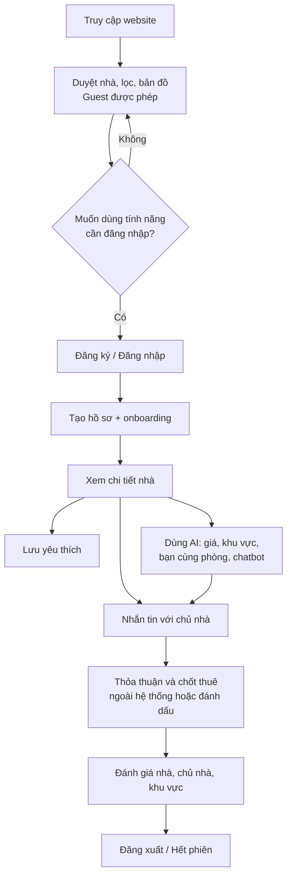

Luồng của Chủ nhà chia nhánh sau bước Đăng nhập: thay vì "duyệt nhà", chủ nhà đi vào **Đăng tin** (mục 12), sau đó nhận và trả lời tin nhắn.

---

## 3. Giai đoạn 0: Truy cập website

### 3.1 Luồng request

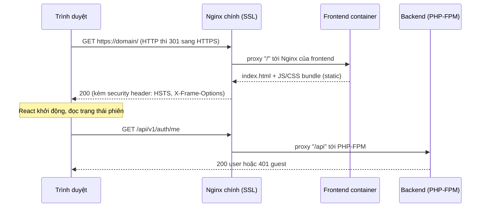

### 3.2 Chi tiết kỹ thuật

1. **DNS trỏ về server**, Nginx lắng nghe cổng 80 và 443. Cổng 80 chỉ redirect sang 443 và phục vụ challenge của Certbot (`nginx/certbot/www`).
2. **SSL termination** tại Nginx chính (`nginx/conf.d/ssl.conf`), chứng chỉ do Certbot cấp và tự gia hạn.
3. Route `/` chuyển tới container `frontend` (Nginx riêng serve bản build tĩnh). Mọi đường dẫn không khớp file thật sẽ fallback về `index.html` để React Router xử lý (SPA).
4. Khi React khởi động, `useAuth` gọi `GET /api/v1/auth/me` để xác định khách hay người dùng đã đăng nhập, từ đó quyết định hiển thị menu và route được phép truy cập.
5. Vì FE và BE cùng domain qua Nginx nên **cookie-based Sanctum (SPA mode)** hoạt động tự nhiên, không phát sinh vấn đề CORS phức tạp. CORS (`config/cors.php`) vẫn cấu hình đúng domain cho môi trường dev.

---

## 4. Giai đoạn 1: Đăng ký, đăng nhập, xác thực

### 4.1 Đăng ký

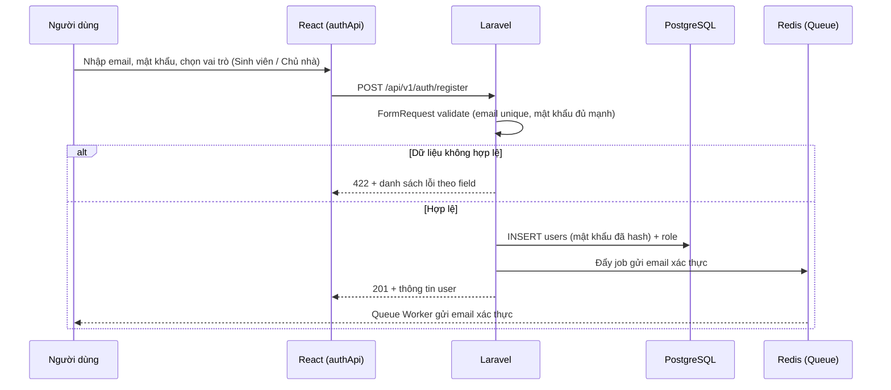

### 4.2 Đăng nhập

1. FE gọi `GET /sanctum/csrf-cookie` để nhận CSRF cookie, sau đó `POST /api/v1/auth/login`.
2. Backend kiểm tra thông tin, tạo session, trả cookie `httpOnly` (JS không đọc được, giảm rủi ro XSS so với lưu token ở localStorage, đúng khuyến nghị ở GUIDE.md).
3. Axios interceptor (`axiosClient.js`) cấu hình `withCredentials: true` và tự xử lý lỗi tập trung:
   - `401`: xóa trạng thái người dùng ở store, chuyển tới trang đăng nhập.
   - `403`: hiển thị thông báo không đủ quyền.
   - `422`: trả lỗi theo field cho form.
   - `429`: hiển thị thông báo thử lại sau.
   - `5xx` / timeout: hiển thị lỗi chung, cho phép thử lại.
4. **Route bảo vệ** phía FE (guard theo vai trò) chỉ cải thiện trải nghiệm. **Phân quyền thật** nằm ở Backend (Middleware + Policy). FE không bao giờ là lớp bảo mật duy nhất.

### 4.3 Các quy tắc bảo mật

1. Rate limit endpoint đăng nhập/đăng ký (Laravel throttle, dùng Redis làm store) để chống brute force.
2. Mật khẩu hash bằng bcrypt/argon2 (mặc định của Laravel).
3. Guest chỉ truy cập được các endpoint đọc công khai (danh sách nhà, chi tiết nhà, bản đồ). Mọi thao tác ghi đều yêu cầu đăng nhập.

---

## 5. Giai đoạn 2: Hồ sơ người dùng & onboarding

### 5.1 Hồ sơ Sinh viên

| Nhóm dữ liệu | Ví dụ | Dùng cho |
|---|---|---|
| Cơ bản | Họ tên, avatar, trường đang học, năm học | Hiển thị, tính khoảng cách tới trường |
| Ngân sách & nhu cầu | Khoảng giá, khu vực ưu tiên, số người ở | Lọc, gợi ý khu vực |
| Lối sống & tính cách | Giờ ngủ, hút thuốc, gọn gàng, thích yên tĩnh, sở thích | **AI gợi ý bạn cùng phòng** |
| Quyền riêng tư | Có cho phép xuất hiện trong gợi ý bạn cùng phòng không | Bật/tắt tham gia AI matching |

### 5.2 Hồ sơ Chủ nhà

Họ tên, số điện thoại, giới thiệu, danh sách tin đăng, điểm đánh giá tổng hợp, trạng thái xác minh **[Giả định]**.

### 5.3 Luồng lưu hồ sơ

1. FE hiển thị form onboarding nhiều bước sau lần đăng nhập đầu tiên (có thể bỏ qua và làm sau).
2. `PUT /api/v1/profile`: Backend validate (FormRequest) rồi lưu bảng `profiles` (Service Layer, không xử lý logic trong Controller).
3. Upload avatar: `POST /api/v1/profile/avatar` (multipart), Backend kiểm tra loại file, dung lượng, lưu vào storage, trả URL.
4. Khi hồ sơ thay đổi ảnh hưởng đến AI (lối sống, ngân sách), Backend **vô hiệu hóa cache kết quả gợi ý cũ** của người dùng đó trong Redis.

---

## 6. Giai đoạn 3: Duyệt nhà, lọc, bản đồ

Đây là tính năng cốt lõi và là phần khách chưa đăng nhập cũng dùng được.

### 6.1 Luồng lọc và tìm kiếm

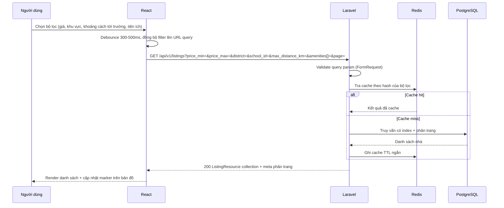

### 6.2 Chi tiết kỹ thuật

1. **Lọc giá, vị trí, tiện ích**: truy vấn có điều kiện, index trên `price`, `district_id`, `status`. Tiện ích lưu bảng nhiều-nhiều `listing_amenities`.
2. **Khoảng cách tới trường**:
   - Bảng `schools` lưu tọa độ (lat/lng).
   - Khi tin đăng được tạo/sửa, Backend tính và lưu khoảng cách vào bảng `listing_school_distances`. Cách tính: công thức Haversine hoặc PostGIS (`ST_Distance`, `ST_DWithin`) **[Giả định]**. Tính sẵn giúp lọc theo khoảng cách nhanh, không phải tính lại mỗi request.
   - Đây có thể đẩy vào Queue Job nếu dùng API bên ngoài để tính quãng đường đi thực tế.
3. **Bản đồ**:
   - FE render bản đồ (Leaflet + OpenStreetMap hoặc Google Maps) **[Giả định]**.
   - Endpoint riêng `GET /api/v1/listings/map?bbox=...` chỉ trả dữ liệu tối thiểu (id, tọa độ, giá) trong khung nhìn hiện tại, tránh tải payload lớn. Khi người dùng kéo/zoom, FE gọi lại với bbox mới (có debounce).
   - Nếu số marker lớn, gom cụm (clustering) phía FE.
4. **Phân trang**: dùng cursor hoặc offset pagination, FE hỗ trợ infinite scroll hoặc nút trang.
5. **Trạng thái UI** bắt buộc xử lý đủ: loading (skeleton), rỗng (không có kết quả, gợi ý nới bộ lọc), lỗi (nút thử lại).

---

## 7. Giai đoạn 4: Chi tiết nhà, yêu thích, đánh giá

### 7.1 Xem chi tiết nhà

1. `GET /api/v1/listings/{id}` trả: thông tin nhà, ảnh, tiện ích, vị trí, khoảng cách tới các trường, thông tin chủ nhà rút gọn, điểm đánh giá tổng hợp.
2. Danh sách đánh giá được tải riêng (`GET /api/v1/listings/{id}/reviews?page=`) để trang mở nhanh.
3. Lượt xem có thể ghi nhận bất đồng bộ (Job) để không làm chậm response.

### 7.2 Lưu yêu thích

1. Người dùng bấm tim: `POST /api/v1/favorites` (body `listing_id`), bỏ tim: `DELETE /api/v1/favorites/{listing_id}`.
2. Thao tác phải **idempotent** (bấm 2 lần không tạo bản ghi trùng, ràng buộc unique `user_id + listing_id`).
3. FE dùng **optimistic update**: đổi icon ngay, nếu API lỗi thì hoàn tác và báo lỗi.
4. Guest bấm tim: hiển thị yêu cầu đăng nhập, sau khi đăng nhập quay lại đúng trang và thực hiện lại.

### 7.3 Xem đánh giá

Điểm trung bình theo nhà, chủ nhà, khu vực được **tổng hợp sẵn** (denormalize hoặc cache Redis) và cập nhật khi có đánh giá mới, không tính `AVG()` trên toàn bảng mỗi lần xem. Việc viết đánh giá xem tại Giai đoạn 7.

---

## 8. Giai đoạn 5: Tính năng AI

### 8.1 Mẫu tích hợp chung (áp dụng cho cả 5 tính năng)

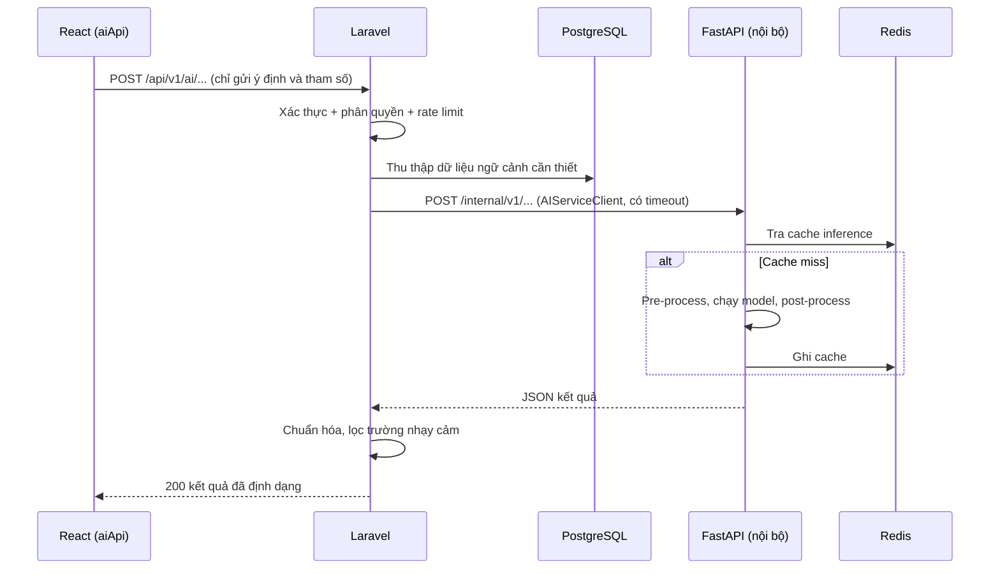

**Nguyên tắc:**

1. **Backend là bên thu thập dữ liệu**. Vì AI Service không đọc DB, Backend truy vấn rồi gửi kèm trong request. Điều này giữ đúng ranh giới ở GUIDE.md.
2. **Tối thiểu hóa dữ liệu cá nhân** gửi sang AI: dùng id ẩn danh và chỉ các trường cần cho tính toán (không gửi email, số điện thoại).
3. **Timeout và fallback**: `AIServiceClient` đặt timeout hợp lý, khi AI chậm hoặc lỗi thì trả lỗi có cấu trúc (`503 AI_UNAVAILABLE`) hoặc kết quả dự phòng (ví dụ danh sách nhà sắp xếp theo giá). Tính năng AI hỏng **không được làm sập luồng chính**.
4. **Đồng bộ hay bất đồng bộ**:
   - Nhanh (dưới vài giây): gọi đồng bộ, FE hiển thị loading.
   - Chậm: mô hình **submit job → trả `job_id` → FE polling** (mục 8.6).
5. Endpoint AI phía Backend chỉ dành cho người dùng đã đăng nhập, có rate limit riêng vì tốn tài nguyên.

### 8.2 Gợi ý người cùng phòng

| Bước | Thực hiện bởi | Nội dung |
|---|---|---|
| 1 | Sinh viên | Vào trang "Tìm bạn cùng phòng", có thể chọn nhà cụ thể đang quan tâm |
| 2 | Backend | Lấy hồ sơ của người yêu cầu, lấy tập ứng viên (sinh viên đã bật tham gia matching, cùng khu vực/ngân sách tương thích) |
| 3 | Backend | Gửi hồ sơ người yêu cầu + danh sách ứng viên (đã ẩn danh hóa) sang AI |
| 4 | AI | Tính điểm tương thích từ tính cách, sở thích, lịch sử; trả danh sách xếp hạng kèm lý do ngắn |
| 5 | Backend | Ghép lại với thông tin công khai của ứng viên, cache kết quả theo user |
| 6 | Frontend | Hiển thị thẻ ứng viên, điểm phù hợp, nút "Nhắn tin" |

Lưu ý: chỉ hiển thị thông tin ứng viên cho phép công khai. Cần cơ chế người dùng **chấp thuận** trước khi bị đưa vào tập matching (xem quyền riêng tư ở mục 5.1).

### 8.3 Trợ lý đàm phán giá

1. Sinh viên đang xem một tin đăng, bấm "Gợi ý giá công bằng".
2. Backend truy vấn các nhà tương đồng (cùng khu vực, diện tích, tiện ích, tình trạng) để tạo **bộ dữ liệu thị trường**, gửi kèm thông tin tin đăng sang AI.
3. AI trả về: khoảng giá hợp lý, mức đánh giá giá đang niêm yết (cao / hợp lý / thấp), lập luận, và gợi ý câu thương lượng.
4. FE hiển thị kết quả, có nút "Chèn vào tin nhắn" để đưa đề xuất vào khung chat với chủ nhà (người dùng vẫn chỉnh sửa trước khi gửi).
5. Kết quả gắn nhãn rõ là **gợi ý tham khảo**, không phải cam kết.

### 8.4 Gợi ý khu vực

1. Đầu vào: ngân sách, trường học, lối sống (từ hồ sơ hoặc form nhanh).
2. Backend gộp dữ liệu tổng hợp theo khu vực (giá trung bình, mật độ nhà, điểm đánh giá khu vực, khoảng cách tới trường) rồi gửi sang AI.
3. AI trả danh sách khu vực xếp hạng kèm lý do. Backend trả cho FE.
4. FE hiển thị trên bản đồ (tô vùng khu vực) và cho phép bấm để áp bộ lọc vào trang duyệt nhà, khép lại vòng lặp tìm kiếm.

### 8.5 Chatbot hỗ trợ

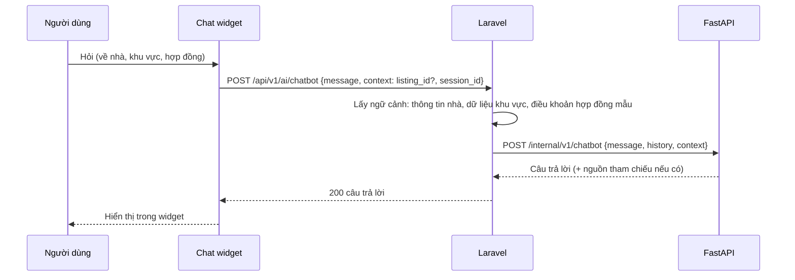

1. Lịch sử hội thoại gần nhất được Backend giữ (Redis theo `session_id`) và gửi kèm mỗi lượt để AI có ngữ cảnh. AI Service giữ stateless.
2. Câu hỏi về hợp đồng cần kèm **thông báo miễn trừ**: chatbot cung cấp thông tin tham khảo, không thay tư vấn pháp lý.
3. Rate limit theo người dùng để kiểm soát chi phí.

### 8.6 Tạo mô tả tự động từ ảnh & thông tin (dành cho Chủ nhà)

Tác vụ chậm (xử lý ảnh), nên dùng mô hình bất đồng bộ.

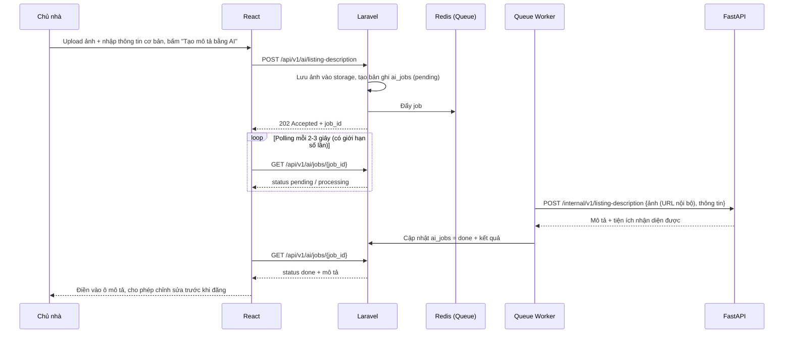

1. Kết quả AI chỉ là **bản nháp**, chủ nhà xem và chỉnh sửa trước khi lưu, tránh đăng thông tin sai về căn nhà.
2. Nếu job thất bại: trạng thái `failed` kèm lý do, FE cho phép thử lại hoặc tự nhập mô tả. Queue Job có cơ chế retry và `failed_jobs`.
3. Nếu người dùng rời trang, job vẫn chạy và kết quả có thể xem lại khi quay về.

---

## 9. Giai đoạn 6: Nhắn tin & chia sẻ tài liệu

### 9.1 Luồng bắt đầu hội thoại

1. Sinh viên bấm "Nhắn tin" ở trang chi tiết nhà. FE gọi `POST /api/v1/conversations` với `listing_id`.
2. Backend tìm hội thoại đã có giữa (sinh viên, chủ nhà, tin đăng) hoặc tạo mới. Thao tác idempotent, không tạo trùng.
3. Backend kiểm tra quyền: chỉ hai thành viên của hội thoại mới đọc/gửi được (Policy).

### 9.2 Gửi và nhận tin nhắn

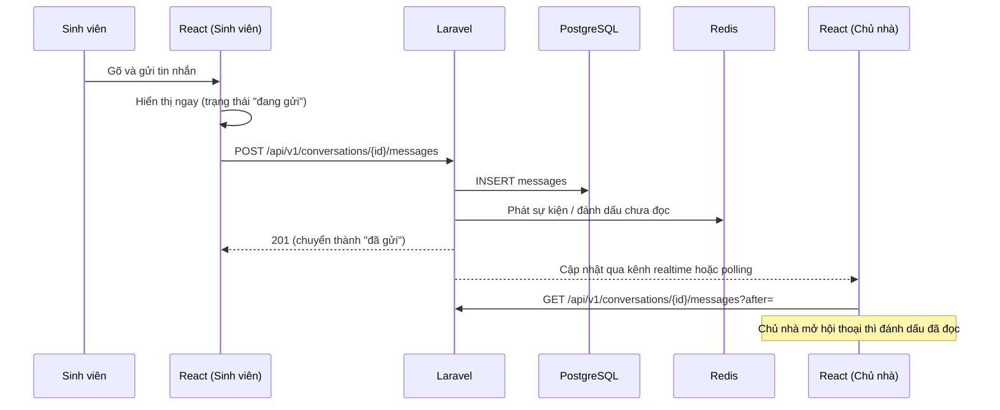

**[Giả định] Cơ chế realtime.** Tech stack trong GUIDE.md chưa có thành phần WebSocket. Hai lựa chọn:

| Phương án | Ưu điểm | Nhược điểm |
|---|---|---|
| Polling (mỗi 3-5 giây) | Đơn giản, không thêm hạ tầng, phù hợp MVP | Tốn request, độ trễ vài giây |
| WebSocket (Laravel Reverb hoặc Pusher) | Realtime thật | Thêm service, thêm route `/ws` ở Nginx và container mới |

Khuyến nghị: bắt đầu bằng polling, thiết kế API tương thích để nâng cấp lên WebSocket sau mà không đổi contract.

### 9.3 Chia sẻ tài liệu

1. FE gọi `POST /api/v1/conversations/{id}/attachments` (multipart).
2. Backend kiểm tra: loại file cho phép (PDF, ảnh, docx), giới hạn dung lượng, quét mở rộng và MIME thật (không tin phần đuôi file).
3. File lưu ở storage **riêng tư**, không public trực tiếp. Tải xuống qua endpoint có kiểm tra quyền hoặc signed URL có hạn.
4. Tin nhắn ghi nhận tệp đính kèm bằng bản ghi `message_attachments`.

### 9.4 Kết nối với AI

Trợ lý đàm phán giá (mục 8.3) chèn gợi ý vào ô soạn tin, người dùng tự quyết định gửi. AI **không** tự gửi tin nhắn thay người dùng.

### 9.5 Chống lạm dụng

Rate limit gửi tin, chặn/báo cáo người dùng, lọc nội dung spam **[Giả định]**.

---

## 10. Giai đoạn 7: Chốt thuê & đánh giá sau thuê

### 10.1 Chốt thuê

Việc ký hợp đồng và thanh toán nằm ngoài phạm vi các tính năng đã liệt kê. Ở mức hệ thống, cần một điểm ghi nhận trạng thái để phục vụ đánh giá:

1. Sinh viên hoặc chủ nhà đánh dấu "đã thuê / đã thuê xong" cho một tin đăng, thay đổi `listings.status` và tạo bản ghi `tenancies` **[Giả định]**.
2. Bản ghi `tenancies` là điều kiện xác thực cho việc đánh giá (chỉ người đã thuê mới đánh giá được).

### 10.2 Đánh giá & xếp hạng

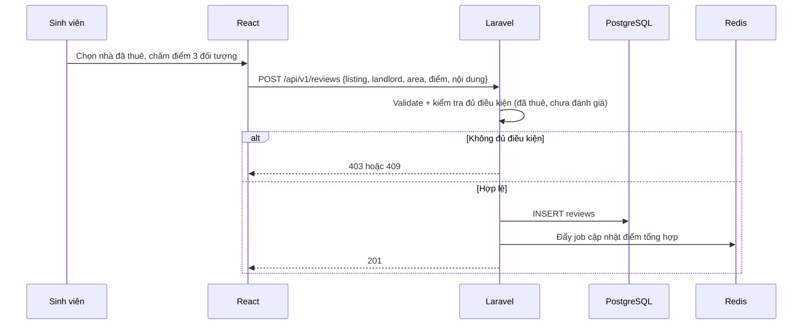

1. Ba đối tượng đánh giá: **nhà**, **chủ nhà**, **khu vực**. Mỗi đối tượng có điểm số riêng, kèm nội dung.
2. Ràng buộc: mỗi người chỉ đánh giá một lần cho mỗi lần thuê (unique constraint).
3. Sau khi lưu, Job cập nhật điểm trung bình tổng hợp và xóa cache liên quan.
4. Chủ nhà có thể phản hồi đánh giá. Nội dung vi phạm có luồng báo cáo và kiểm duyệt **[Giả định]**.
5. Điểm đánh giá khu vực được đưa vào dữ liệu đầu vào của **AI gợi ý khu vực** (mục 8.4).

---

## 11. Giai đoạn 8: Kết thúc phiên

1. Người dùng bấm "Đăng xuất": `POST /api/v1/auth/logout`. Backend hủy session và xóa cookie.
2. FE xóa toàn bộ state nhạy cảm trong store (thông tin người dùng, cache tin nhắn, kết quả AI), rồi chuyển về trang chủ ở trạng thái guest.
3. Hết hạn phiên: request kế tiếp nhận `401`, interceptor xử lý như ở mục 4.2.
4. Dữ liệu tạm hết hạn tự động (cache Redis theo TTL, hội thoại chatbot theo `session_id`). Dữ liệu chính (hồ sơ, yêu thích, tin nhắn, đánh giá) nằm ở PostgreSQL và được giữ lại cho lần sau.
5. Người dùng có thể quay lại bất kỳ lúc nào, hệ thống khôi phục trạng thái từ dữ liệu đã lưu.

---

## 12. Luồng riêng của Chủ nhà: đăng tin

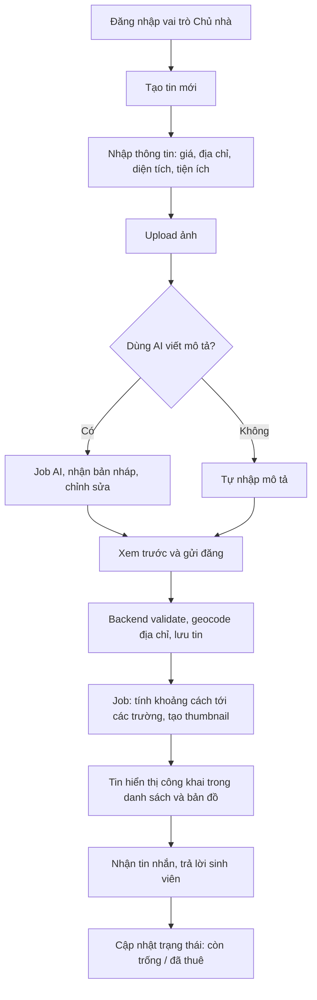

Các điểm kỹ thuật:

1. **Geocoding** địa chỉ thành tọa độ khi lưu tin (dịch vụ bên ngoài hoặc cho chủ nhà ghim vị trí trên bản đồ), tọa độ là đầu vào cho bản đồ và tính khoảng cách.
2. **Xử lý ảnh** (nén, tạo thumbnail) đưa vào Queue Job để không chặn request.
3. Chỉ chủ sở hữu mới sửa/xóa được tin của mình (Policy).
4. Có thể thêm bước duyệt tin trước khi hiển thị công khai **[Giả định]**.
5. Khi tin thay đổi giá hoặc vị trí, cần **xóa cache** danh sách liên quan và tính lại khoảng cách.

---

## 13. Các mối quan tâm xuyên suốt (cross-cutting)

### 13.1 Định dạng response và mã lỗi thống nhất

Response thành công và lỗi dùng chung một cấu trúc (chốt trong `API_CONTRACT.md`), ví dụ:

```json
{
  "success": false,
  "error": {
    "code": "VALIDATION_ERROR",
    "message": "Dữ liệu không hợp lệ",
    "details": { "price_max": ["Phải lớn hơn price_min"] }
  }
}
```

| HTTP | Ý nghĩa | Cách FE xử lý |
|---|---|---|
| 401 | Chưa đăng nhập / hết phiên | Chuyển tới đăng nhập |
| 403 | Không đủ quyền | Thông báo, ẩn chức năng |
| 404 | Không tìm thấy | Trang not found |
| 409 | Xung đột (trùng dữ liệu) | Thông báo cụ thể |
| 422 | Dữ liệu không hợp lệ | Hiển thị lỗi theo field |
| 429 | Vượt giới hạn tần suất | Thông báo thử lại sau |
| 503 | Dịch vụ phụ (AI) không sẵn sàng | Hiển thị phương án dự phòng |

### 13.2 Cache (Redis)

| Loại | Chủ sở hữu | TTL gợi ý |
|---|---|---|
| Danh sách nhà theo bộ lọc | Backend | Ngắn (1-5 phút) |
| Điểm đánh giá tổng hợp | Backend | Xóa khi có đánh giá mới |
| Kết quả gợi ý AI theo người dùng | Backend | Xóa khi hồ sơ đổi |
| Kết quả inference lặp lại | AI Service | Theo tính năng |
| Lịch sử chatbot theo session | Backend | Theo thời gian phiên |

### 13.3 Hàng đợi (Queue)

Mọi việc nặng hoặc không cần trả kết quả ngay đều vào Queue Worker (chạy dưới Supervisor cùng PHP-FPM): gửi email, xử lý ảnh, tạo mô tả AI, tính khoảng cách, cập nhật điểm tổng hợp. Cần cấu hình retry, backoff và theo dõi `failed_jobs`.

### 13.4 Bảo mật

1. Validate mọi input ở Backend (FormRequest), FE validate chỉ để trải nghiệm tốt hơn.
2. Phân quyền bằng Policy theo từng resource (chủ tin, thành viên hội thoại, tác giả đánh giá).
3. Chống XSS: escape nội dung người dùng nhập (tin nhắn, đánh giá, mô tả). Chống CSRF bằng cơ chế Sanctum.
4. AI Service nằm trong mạng nội bộ Docker, không có route public trên Nginx (mục "Checklist trước khi launch" của GUIDE.md).
5. Nội dung do AI sinh ra được coi là **dữ liệu không tin cậy**: escape khi hiển thị, không thực thi.
6. Tuân thủ quyền riêng tư: chỉ chia sẻ dữ liệu cá nhân cần thiết, cho người dùng tùy chọn tham gia matching.

### 13.5 Quan sát hệ thống (Observability)

1. Mỗi request gắn **correlation ID** (`X-Request-ID`) tại Nginx, Backend truyền tiếp sang AI Service để lần theo toàn bộ luồng FE, BE, AI khi có lỗi.
2. Log có cấu trúc ở cả 3 service, tách theo mức độ.
3. Health check: `/health` của AI Service, healthcheck cho các container trong Docker Compose.
4. Theo dõi độ trễ endpoint AI, tỷ lệ lỗi, độ dài hàng đợi.

### 13.6 Hiệu năng

1. Index cho các cột lọc thường dùng, tránh N+1 (eager loading).
2. Phân trang mọi danh sách, giới hạn kích thước trang.
3. FE: code splitting theo route, lazy load ảnh, debounce ô tìm kiếm và sự kiện bản đồ.
4. AI: load model một lần khi khởi động, cache inference, đo benchmark.

---

## 14. Giả định & Điểm cần quyết định

Những điểm tài liệu gốc chưa quy định, cần cả nhóm thống nhất trước khi chốt `API_CONTRACT.md`:

| # | Vấn đề | Đề xuất |
|---|---|---|
| 1 | Cơ chế realtime cho chat | Bắt đầu bằng polling, nâng lên WebSocket sau |
| 2 | Lưu trữ ảnh và tệp | Docker volume cho MVP, S3 tương thích khi lên production |
| 3 | Bản đồ và geocoding | Leaflet + OpenStreetMap (miễn phí) hoặc Google Maps (chi phí) |
| 4 | Tính khoảng cách | Tính sẵn khi lưu tin, dùng PostGIS nếu cần truy vấn không gian |
| 5 | Xác thực | Sanctum SPA cookie vì FE và BE cùng domain |
| 6 | Vai trò và quyền | Trường `role` (student, landlord, admin) + Policy |
| 7 | Kiểm duyệt tin và đánh giá | Cần có luồng admin tối thiểu |
| 8 | Điều kiện được đánh giá | Chỉ người có bản ghi thuê (`tenancies`) |
| 9 | Chatbot về hợp đồng | Cần nguồn tri thức (hợp đồng mẫu) do Backend cung cấp, kèm miễn trừ trách nhiệm |
| 10 | Đồng bộ hay bất đồng bộ cho từng tính năng AI | Chatbot, giá, khu vực: đồng bộ. Mô tả từ ảnh, matching lớn: bất đồng bộ |
| 11 | Vai trò Admin | Chưa có trong tài liệu gốc, nên bổ sung nếu cần kiểm duyệt |

---

## 15. Phụ lục

### 15.1 Data model (mức khái niệm)

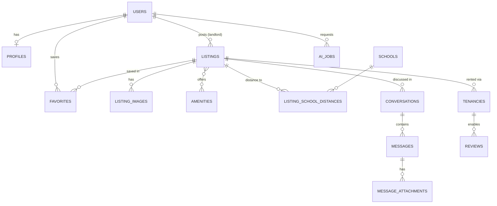

### 15.2 Endpoint Backend đề xuất (`/api/v1`)

| Nhóm | Endpoint | Auth |
|---|---|---|
| Auth | `POST /auth/register`, `POST /auth/login`, `POST /auth/logout`, `GET /auth/me` | Công khai / đăng nhập |
| Hồ sơ | `GET·PUT /profile`, `POST /profile/avatar` | Đăng nhập |
| Nhà | `GET /listings`, `GET /listings/map`, `GET /listings/{id}` | Công khai |
| Tin đăng (chủ nhà) | `POST /listings`, `PUT·DELETE /listings/{id}` | Chủ nhà sở hữu |
| Yêu thích | `GET·POST /favorites`, `DELETE /favorites/{listing_id}` | Đăng nhập |
| Chat | `POST /conversations`, `GET /conversations`, `GET·POST /conversations/{id}/messages`, `POST /conversations/{id}/attachments` | Thành viên hội thoại |
| Đánh giá | `GET /listings/{id}/reviews`, `POST /reviews` | Công khai (xem) / đủ điều kiện (viết) |
| AI | `POST /ai/roommates`, `POST /ai/price-suggestion`, `POST /ai/area-recommendations`, `POST /ai/chatbot`, `POST /ai/listing-description`, `GET /ai/jobs/{id}` | Đăng nhập |

### 15.3 Endpoint nội bộ AI Service đề xuất (`/internal/v1`)

| Endpoint | Chức năng |
|---|---|
| `POST /roommate-matching` | Xếp hạng tương thích giữa sinh viên |
| `POST /price-suggestion` | Ước lượng giá công bằng từ dữ liệu thị trường |
| `POST /area-recommendation` | Xếp hạng khu vực theo ngân sách và lối sống |
| `POST /chatbot` | Trả lời câu hỏi có ngữ cảnh |
| `POST /listing-description` | Sinh mô tả từ ảnh và thông tin cơ bản |
| `GET /health` | Health check |

Các endpoint trên chỉ truy cập được từ mạng Docker nội bộ, không có route công khai qua Nginx.

---

**Nguyên tắc cần nhớ:** mọi thay đổi ảnh hưởng đến API contract giữa Frontend, Backend và AI phải được cập nhật vào `API_CONTRACT.md` và thông báo ngay cho cả nhóm.
